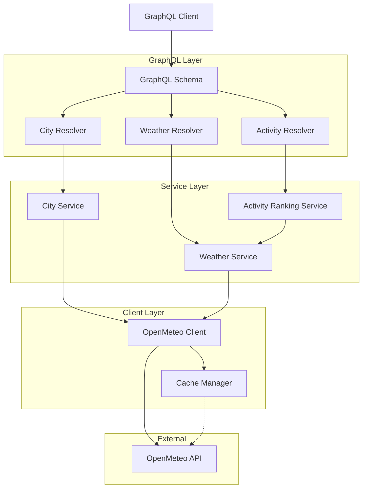

# Design Document: Travel Planning GraphQL API

## Overview

This document provides a comprehensive technical design for a scalable, maintainable GraphQL API that supports travel planning functionality. The system integrates with the OpenMeteo API to provide city suggestions, weather forecasts, and activity recommendations based on weather conditions.

The design emphasizes clean architecture principles, clear separation of concerns, testability, and extensibility. The architecture follows a layered approach where each layer has distinct responsibilities and dependencies flow inward toward the business logic core.

### Core Technical Challenges

1. **External API Integration**: Abstracting OpenMeteo API calls to enable testing, error handling, and potential provider switching
2. **Activity Ranking Algorithm**: Designing a flexible, data-driven scoring system that evaluates activities based on multiple weather parameters
3. **GraphQL Schema Design**: Creating an intuitive, extensible schema that models the domain effectively while supporting future enhancements
4. **Error Handling**: Implementing consistent error handling across layers with meaningful client feedback
5. **Performance**: Balancing API responsiveness with external API rate limits through strategic caching

## Architecture

### Layered Architecture

The system follows a clean architecture pattern with four primary layers:

```
┌─────────────────────────────────────────────────────────────┐
│                     GraphQL Layer                            │
│  (Schema, Resolvers, Type Definitions)                      │
│  - Handles HTTP requests                                     │
│  - Validates GraphQL queries                                 │
│  - Delegates to service layer                                │
└─────────────────────────────────────────────────────────────┘
                            ↓
┌─────────────────────────────────────────────────────────────┐
│                     Service Layer                            │
│  (CityService, WeatherService, ActivityRankingService)      │
│  - Contains business logic                                   │
│  - Orchestrates data operations                              │
│  - Independent of delivery mechanism                         │
└─────────────────────────────────────────────────────────────┘
                            ↓
┌─────────────────────────────────────────────────────────────┐
│                     Client Layer                             │
│  (OpenMeteoClient, Cache abstraction)                       │
│  - Abstracts external API communication                      │
│  - Handles HTTP requests/responses                           │
│  - Manages error translation                                 │
└─────────────────────────────────────────────────────────────┘
                            ↓
┌─────────────────────────────────────────────────────────────┐
│                  External Services                           │
│  (OpenMeteo API)                                            │
└─────────────────────────────────────────────────────────────┘
```

### Architecture Diagram



### Clean Architecture Justification

**Dependency Inversion**: Services depend on abstractions (interfaces) rather than concrete implementations. The OpenMeteoClient implements an interface, allowing easy mocking and potential replacement.

**Separation of Concerns**: Each layer has a single responsibility:

- GraphQL layer handles request/response formatting
- Service layer contains business logic
- Client layer manages external communication

**Testability**: Business logic in services can be tested independently by mocking the client layer. Resolvers can be tested by mocking services.

**Maintainability**: Changes to external APIs are isolated to the client layer. Business logic changes don't affect the GraphQL schema. New features can be added without modifying existing code.

**Scalability**: Stateless services enable horizontal scaling. Caching layer can be extracted to Redis without changing business logic.

## Technology Stack & Justification

### Core Framework: AdonisJS v6

**Rationale**:

- Already present in the workspace
- Built-in IoC container for dependency injection
- Excellent TypeScript support with decorators
- Integrated testing utilities
- Middleware pipeline for cross-cutting concerns
- Environment configuration management

### GraphQL Server: Apollo Server

**Rationale**:

- Industry standard with excellent documentation
- Built-in error handling and validation
- Schema-first or code-first approaches
- Playground for development
- Extensible with plugins
- Strong TypeScript support

### HTTP Client: Axios

**Rationale**:

- Promise-based with clean API
- Automatic JSON transformation
- Request/response interceptors for logging
- Timeout configuration
- Error handling utilities
- Wide adoption and stability

### Testing Libraries

**Jest**:

- Comprehensive testing framework
- Built-in mocking capabilities
- Snapshot testing for GraphQL schemas
- Code coverage reporting
- Parallel test execution

**Supertest**:

- HTTP assertion library
- Integration testing for GraphQL endpoints
- Works seamlessly with AdonisJS

### Optional Caching: In-Memory Cache (Initial) → Redis (Production)

**Rationale**:

- Start with simple in-memory cache for development
- Abstract behind interface for easy Redis migration
- Configurable TTL per cache key type
- Cache invalidation strategies

### Additional Libraries

- **class-validator**: DTO validation
- **date-fns**: Date manipulation for weather forecasts
- **dotenv**: Environment variable management

## Components and Interfaces

### Folder Structure

```
app/
├── graphql/
│   ├── schema.graphql              # GraphQL schema definition
│   ├── resolvers/
│   │   ├── city_resolver.ts        # City query resolvers
│   │   ├── weather_resolver.ts     # Weather query resolvers
│   │   └── activity_resolver.ts    # Activity query resolvers
│   └── types/
│       ├── city_types.ts           # GraphQL type definitions
│       ├── weather_types.ts
│       └── activity_types.ts
├── services/
│   ├── city_service.ts             # City search business logic
│   ├── weather_service.ts          # Weather forecast business logic
│   └── activity_ranking_service.ts # Activity scoring logic
├── clients/
│   ├── interfaces/
│   │   └── weather_client_interface.ts
│   ├── open_meteo_client.ts        # OpenMeteo API client
│   └── cache_manager.ts            # Caching abstraction
├── models/
│   ├── city.ts                     # City domain model
│   ├── weather.ts                  # Weather domain model
│   └── activity.ts                 # Activity domain model
├── types/
│   ├── open_meteo_types.ts         # OpenMeteo API response types
│   └── enums.ts                    # Shared enums
└── exceptions/
    ├── weather_api_exception.ts    # Custom exceptions
    └── validation_exception.ts

tests/
├── unit/
│   ├── services/
│   │   ├── city_service.test.ts
│   │   ├── weather_service.test.ts
│   │   └── activity_ranking_service.test.ts
│   └── clients/
│       └── open_meteo_client.test.ts
└── integration/
    └── graphql/
        ├── city_queries.test.ts
        ├── weather_queries.test.ts
        └── activity_queries.test.ts
```

### Interface Definitions

#### IWeatherClient Interface

```typescript
interface IWeatherClient {
  searchCities(query: string): Promise<City[]>
  getWeatherForecast(latitude: number, longitude: number, days: number): Promise<WeatherForecast>
}
```

#### ICacheManager Interface

```typescript
interface ICacheManager {
  get<T>(key: string): Promise<T | null>
  set<T>(key: string, value: T, ttlSeconds: number): Promise<void>
  delete(key: string): Promise<void>
  clear(): Promise<void>
}
```

## Data Models

### City Model

```typescript
class City {
  id: number
  name: string
  country: string
  countryCode: string
  latitude: number
  longitude: number
  timezone: string
  population?: number

  constructor(data: CityData) {
    // Validation and initialization
  }
}
```

### Weather Model

```typescript
class WeatherForecast {
  latitude: number
  longitude: number
  timezone: string
  dailyForecasts: DailyForecast[]

  constructor(data: WeatherData) {
    // Validation and initialization
  }
}

class DailyForecast {
  date: Date
  temperatureMax: number
  temperatureMin: number
  precipitation: number
  windSpeed: number
  weatherCode: number

  getWeatherCondition(): WeatherCondition {
    // Map weather code to condition enum
  }
}
```

### Activity Model

```typescript
enum ActivityType {
  SKIING = 'SKIING',
  SURFING = 'SURFING',
  INDOOR_SIGHTSEEING = 'INDOOR_SIGHTSEEING',
  OUTDOOR_SIGHTSEEING = 'OUTDOOR_SIGHTSEEING',
}

class RankedActivity {
  type: ActivityType
  score: number
  suitability: string // 'EXCELLENT', 'GOOD', 'FAIR', 'POOR'
  reason: string

  constructor(type: ActivityType, score: number, reason: string) {
    this.type = type
    this.score = score
    this.suitability = this.calculateSuitability(score)
    this.reason = reason
  }

  private calculateSuitability(score: number): string {
    if (score >= 80) return 'EXCELLENT'
    if (score >= 60) return 'GOOD'
    if (score >= 40) return 'FAIR'
    return 'POOR'
  }
}
```

## Data Models

## GraphQL Schema Design

### Complete Schema

```graphql
# Enums
enum ActivityType {
  SKIING
  SURFING
  INDOOR_SIGHTSEEING
  OUTDOOR_SIGHTSEEING
}

enum Suitability {
  EXCELLENT
  GOOD
  FAIR
  POOR
}

enum WeatherCondition {
  CLEAR
  PARTLY_CLOUDY
  CLOUDY
  RAINY
  SNOWY
  STORMY
}

# Types
type City {
  id: Int!
  name: String!
  country: String!
  countryCode: String!
  latitude: Float!
  longitude: Float!
  timezone: String!
  population: Int
}

type DailyForecast {
  date: String!
  temperatureMax: Float!
  temperatureMin: Float!
  precipitation: Float!
  windSpeed: Float!
  weatherCondition: WeatherCondition!
}

type WeatherForecast {
  latitude: Float!
  longitude: Float!
  timezone: String!
  dailyForecasts: [DailyForecast!]!
}

type RankedActivity {
  type: ActivityType!
  score: Float!
  suitability: Suitability!
  reason: String!
}

type ActivityRecommendations {
  city: City!
  forecast: WeatherForecast!
  activities: [RankedActivity!]!
  generatedAt: String!
}

# Input Types
input WeatherForecastInput {
  latitude: Float!
  longitude: Float!
  days: Int = 7
}

# Queries
type Query {
  """
  Search for cities by name (partial or complete match)
  Returns up to 10 results by default
  """
  searchCities(query: String!, limit: Int = 10): [City!]!

  """
  Get weather forecast for specific coordinates
  """
  getWeatherForecast(input: WeatherForecastInput!): WeatherForecast!

  """
  Get activity recommendations based on weather forecast
  """
  getActivityRecommendations(cityId: Int!, days: Int = 7): ActivityRecommendations!
}

# Error Types
type Error {
  message: String!
  code: String!
  path: [String!]
}
```

### Schema Design Decisions

**Clear Type Names**: Types like `City`, `WeatherForecast`, and `RankedActivity` clearly represent domain concepts.

**Enums for Constraints**: `ActivityType`, `Suitability`, and `WeatherCondition` use enums to provide type safety and clear documentation of valid values.

**Input Types**: `WeatherForecastInput` groups related parameters and provides default values (days = 7).

**Non-Nullable Fields**: Core fields use `!` to indicate they will always be present, improving client confidence.

**Nested Types**: `ActivityRecommendations` combines city, forecast, and activities in a single response, reducing round trips.

**Default Parameters**: Sensible defaults (limit = 10, days = 7) reduce client complexity.

**Documentation**: Schema includes descriptions for queries to improve developer experience.

### Pagination Considerations

For the initial implementation, pagination is handled through the `limit` parameter on `searchCities`. This is sufficient for city search results which are naturally limited.

**Future Enhancement**: If the API needs to support large result sets, implement cursor-based pagination:

```graphql
type CityConnection {
  edges: [CityEdge!]!
  pageInfo: PageInfo!
}

type CityEdge {
  node: City!
  cursor: String!
}

type PageInfo {
  hasNextPage: Boolean!
  endCursor: String
}
```

### Error Handling Approach

**GraphQL Errors**: Use Apollo Server's built-in error handling with custom error codes:

```typescript
class WeatherAPIException extends ApolloError {
  constructor(message: string) {
    super(message, 'WEATHER_API_ERROR')
  }
}

class ValidationException extends ApolloError {
  constructor(message: string) {
    super(message, 'VALIDATION_ERROR')
  }
}
```

**Error Codes**:

- `WEATHER_API_ERROR`: OpenMeteo API failures
- `VALIDATION_ERROR`: Invalid input parameters
- `NOT_FOUND`: City or resource not found
- `INTERNAL_SERVER_ERROR`: Unexpected errors

**Error Response Format**:

```json
{
  "errors": [
    {
      "message": "Unable to fetch weather data",
      "extensions": {
        "code": "WEATHER_API_ERROR",
        "details": "OpenMeteo API timeout"
      }
    }
  ]
}
```

## Correctness Properties

_A property is a characteristic or behavior that should hold true across all valid executions of a system—essentially, a formal statement about what the system should do. Properties serve as the bridge between human-readable specifications and machine-verifiable correctness guarantees._

### Property 1: City search returns relevant matches

_For any_ city name query (partial or complete), all returned cities should contain the search string in their name, and results should be ordered by relevance (exact matches first, then by population).

**Validates: Requirements 1.1, 1.2**

### Property 2: City data transformation completeness

_For any_ OpenMeteo geolocation API response, the transformed City object should contain all required fields: name, country, countryCode, latitude, longitude, and timezone.

**Validates: Requirements 1.4**

### Property 3: Weather forecast completeness

_For any_ valid coordinate pair and day count, the weather forecast response should contain exactly the requested number of daily forecasts, and each forecast should include temperature, precipitation, wind speed, and weather condition.

**Validates: Requirements 2.1, 2.4**

### Property 4: Skiing ranks highest in snowy conditions

_For any_ weather forecast with snow (weather code indicating snow) and temperature below 5°C, the activity ranking should place skiing as the highest scored activity.

**Validates: Requirements 3.1**

### Property 5: Warm weather favors outdoor activities

_For any_ weather forecast with temperature above 20°C and precipitation below 2mm, both surfing and outdoor sightseeing should score higher than indoor sightseeing.

**Validates: Requirements 3.2**

### Property 6: Rain favors indoor activities

_For any_ weather forecast with precipitation above 5mm or weather code indicating rain, indoor sightseeing should score higher than all outdoor activities (skiing, surfing, outdoor sightseeing).

**Validates: Requirements 3.3**

### Property 7: Activity ranking determinism

_For any_ weather forecast data, running the activity ranking algorithm multiple times should produce identical scores and ordering.

**Validates: Requirements 3.5**

### Property 8: GraphQL error structure consistency

_For any_ error condition (invalid input, API failure, not found), the GraphQL error response should include a message, error code, and optional details field.

**Validates: Requirements 4.3**

### Property 9: OpenMeteo response validation

_For any_ response received from the OpenMeteo API, the client should validate that required fields are present before returning data to services.

**Validates: Requirements 9.2**

### Property 10: Cache hit reduces API calls

_For any_ city search or weather request, if the same query is made within the cache TTL window, the second request should return cached data without calling the external API.

**Validates: Requirements 10.1, 10.2**

### Property 11: Cache expiration

_For any_ cached data, after the TTL expires, the next request should fetch fresh data from the external API and update the cache.

**Validates: Requirements 10.3**

## Detailed Module Breakdown

### CityService

**Responsibility**: Orchestrate city search operations and coordinate with the OpenMeteo client.

**Interface**:

```typescript
class CityService {
  constructor(
    private weatherClient: IWeatherClient,
    private cacheManager: ICacheManager
  ) {}

  async searchCities(query: string, limit: number = 10): Promise<City[]>
  private sanitizeQuery(query: string): string
  private orderByRelevance(cities: City[], query: string): City[]
}
```

**Key Methods**:

- `searchCities(query, limit)`:
  - Validates and sanitizes input
  - Checks cache for existing results
  - Calls OpenMeteo client if cache miss
  - Orders results by relevance (exact match > population)
  - Limits results to specified count
  - Caches results with 1-hour TTL

- `sanitizeQuery(query)`:
  - Trims whitespace
  - Removes special characters that could cause API issues
  - Converts to lowercase for consistent caching

- `orderByRelevance(cities, query)`:
  - Exact matches first
  - Then by population (descending)
  - Stable sort for determinism

**Error Handling**:

- Empty query returns empty array (not an error)
- API failures throw `WeatherAPIException`
- Invalid characters are sanitized, not rejected

### WeatherService

**Responsibility**: Retrieve and process weather forecast data.

**Interface**:

```typescript
class WeatherService {
  constructor(
    private weatherClient: IWeatherClient,
    private cacheManager: ICacheManager
  ) {}

  async getWeatherForecast(
    latitude: number,
    longitude: number,
    days: number = 7
  ): Promise<WeatherForecast>

  private validateCoordinates(latitude: number, longitude: number): void
  private mapWeatherCode(code: number): WeatherCondition
}
```

**Key Methods**:

- `getWeatherForecast(latitude, longitude, days)`:
  - Validates coordinates (-90 to 90 lat, -180 to 180 lon)
  - Checks cache using coordinates + days as key
  - Calls OpenMeteo client if cache miss
  - Maps weather codes to enum values
  - Caches results with 30-minute TTL

- `validateCoordinates(latitude, longitude)`:
  - Throws `ValidationException` if out of range
  - Ensures numeric values

- `mapWeatherCode(code)`:
  - Maps OpenMeteo weather codes to `WeatherCondition` enum
  - 0-1: CLEAR
  - 2-3: PARTLY_CLOUDY
  - 45-48: CLOUDY
  - 51-67: RAINY
  - 71-77: SNOWY
  - 80-99: STORMY

**Error Handling**:

- Invalid coordinates throw `ValidationException`
- API failures throw `WeatherAPIException`
- Missing data fields use sensible defaults (0 for precipitation, etc.)

### ActivityRankingService

**Responsibility**: Analyze weather forecasts and rank activities by suitability.

**Interface**:

```typescript
class ActivityRankingService {
  constructor(private weatherService: WeatherService) {}

  async rankActivities(
    latitude: number,
    longitude: number,
    days: number = 7
  ): Promise<RankedActivity[]>

  private scoreSkiing(forecast: DailyForecast): number
  private scoreSurfing(forecast: DailyForecast): number
  private scoreIndoorSightseeing(forecast: DailyForecast): number
  private scoreOutdoorSightseeing(forecast: DailyForecast): number
  private aggregateScores(dailyScores: Map<ActivityType, number[]>): Map<ActivityType, number>
}
```

**Key Methods**:

- `rankActivities(latitude, longitude, days)`:
  - Fetches weather forecast via WeatherService
  - Scores each activity for each day
  - Aggregates scores across all days (average)
  - Sorts activities by score (descending)
  - Returns ranked list with reasons

- `scoreSkiing(forecast)`:
  - Base score: 50
  - +30 if temperature < 0°C
  - +20 if temperature 0-5°C
  - +20 if snow (weather code 71-77)
  - +10 if precipitation > 5mm
  - -20 if temperature > 15°C
  - Max: 100, Min: 0

- `scoreSurfing(forecast)`:
  - Base score: 50
  - +30 if temperature > 20°C
  - +20 if temperature 15-20°C
  - -30 if precipitation > 5mm
  - -20 if wind speed > 30 km/h
  - +10 if wind speed 10-20 km/h (good for surfing)
  - Max: 100, Min: 0

- `scoreIndoorSightseeing(forecast)`:
  - Base score: 60 (always viable)
  - +30 if precipitation > 5mm
  - +20 if temperature < 5°C or > 35°C
  - +10 if stormy conditions
  - Max: 100, Min: 40

- `scoreOutdoorSightseeing(forecast)`:
  - Base score: 50
  - +30 if temperature 15-25°C
  - +20 if temperature 10-15°C or 25-30°C
  - -30 if precipitation > 2mm
  - -20 if wind speed > 40 km/h
  - +10 if clear or partly cloudy
  - Max: 100, Min: 0

- `aggregateScores(dailyScores)`:
  - Calculates average score across all forecast days
  - Ensures deterministic ordering by activity type enum order for ties

**Scoring Rationale**:

- Skiing: Favors cold, snowy conditions
- Surfing: Favors warm, dry weather with moderate wind
- Indoor: Always viable, boosted by poor outdoor conditions
- Outdoor: Favors mild, dry, calm weather

**Extensibility**:

- New activities can be added by implementing new scoring methods
- Scoring weights can be externalized to configuration
- Machine learning models could replace rule-based scoring

### OpenMeteoClient

**Responsibility**: Abstract all communication with the OpenMeteo API.

**Interface**:

```typescript
class OpenMeteoClient implements IWeatherClient {
  private readonly baseUrl = 'https://api.open-meteo.com/v1'
  private readonly geocodingUrl = 'https://geocoding-api.open-meteo.com/v1'
  private httpClient: AxiosInstance

  constructor() {
    this.httpClient = axios.create({
      timeout: 5000,
      headers: { 'Content-Type': 'application/json' },
    })
  }

  async searchCities(query: string): Promise<City[]>
  async getWeatherForecast(
    latitude: number,
    longitude: number,
    days: number
  ): Promise<WeatherForecast>

  private handleApiError(error: AxiosError): never
}
```

**Key Methods**:

- `searchCities(query)`:
  - Calls `/search?name={query}&count=10&language=en&format=json`
  - Parses response into City objects
  - Handles empty results gracefully
  - Throws `WeatherAPIException` on API errors

- `getWeatherForecast(latitude, longitude, days)`:
  - Calls `/forecast?latitude={lat}&longitude={lon}&daily=temperature_2m_max,temperature_2m_min,precipitation_sum,windspeed_10m_max,weathercode&forecast_days={days}`
  - Parses response into WeatherForecast object
  - Validates required fields are present
  - Throws `WeatherAPIException` on API errors

- `handleApiError(error)`:
  - Extracts meaningful error messages from Axios errors
  - Distinguishes between network errors, timeouts, and API errors
  - Throws appropriate `WeatherAPIException` with context

**Error Handling**:

- Network timeouts: 5-second timeout with retry logic (future enhancement)
- 4xx errors: Throw `ValidationException` with API message
- 5xx errors: Throw `WeatherAPIException` with retry suggestion
- Malformed responses: Throw `WeatherAPIException` with parsing details

**Testing Strategy**:

- Mock Axios for unit tests
- Use nock for integration tests with real HTTP mocking
- Test timeout scenarios
- Test malformed response handling

### CacheManager

**Responsibility**: Provide a simple caching abstraction that can be swapped between in-memory and Redis.

**Interface**:

```typescript
class CacheManager implements ICacheManager {
  private cache: Map<string, CacheEntry>

  async get<T>(key: string): Promise<T | null>
  async set<T>(key: string, value: T, ttlSeconds: number): Promise<void>
  async delete(key: string): Promise<void>
  async clear(): Promise<void>

  private isExpired(entry: CacheEntry): boolean
  private cleanup(): void
}

interface CacheEntry {
  value: any
  expiresAt: number
}
```

**Key Methods**:

- `get<T>(key)`:
  - Returns cached value if exists and not expired
  - Returns null if not found or expired
  - Automatically removes expired entries

- `set<T>(key, value, ttlSeconds)`:
  - Stores value with expiration timestamp
  - Triggers cleanup if cache size > 1000 entries

- `cleanup()`:
  - Removes all expired entries
  - Called periodically to prevent memory leaks

**Cache Key Patterns**:

- City search: `city:search:{sanitized_query}`
- Weather forecast: `weather:{lat}:{lon}:{days}`

**TTL Strategy**:

- City search: 3600 seconds (1 hour) - cities don't change frequently
- Weather forecast: 1800 seconds (30 minutes) - weather updates regularly

**Future Enhancement**:

- Implement RedisCache class with same interface
- Use dependency injection to swap implementations
- Add cache statistics and monitoring

## Data Flow Specification

### Request Flow: City Search

```
1. Client sends GraphQL query:
   query {
     searchCities(query: "Lond", limit: 5) {
       id
       name
       country
       latitude
       longitude
     }
   }

2. Apollo Server receives request
   ↓
3. GraphQL validation layer validates query structure
   ↓
4. CityResolver.searchCities() is invoked
   ↓
5. CityResolver calls CityService.searchCities("Lond", 5)
   ↓
6. CityService sanitizes query → "lond"
   ↓
7. CityService checks cache with key "city:search:lond"
   ↓
8a. Cache HIT: Return cached cities (skip to step 11)
8b. Cache MISS: Continue to step 9
   ↓
9. CityService calls OpenMeteoClient.searchCities("lond")
   ↓
10. OpenMeteoClient makes HTTP GET to:
    https://geocoding-api.open-meteo.com/v1/search?name=lond&count=10
    ↓
11. OpenMeteo API returns JSON response
    ↓
12. OpenMeteoClient parses response into City[] objects
    ↓
13. CityService receives City[] from client
    ↓
14. CityService orders cities by relevance
    ↓
15. CityService limits results to 5 cities
    ↓
16. CityService caches results with 1-hour TTL
    ↓
17. CityService returns City[] to resolver
    ↓
18. CityResolver returns data to GraphQL layer
    ↓
19. Apollo Server serializes response to JSON
    ↓
20. Client receives response:
    {
      "data": {
        "searchCities": [
          {
            "id": 2643743,
            "name": "London",
            "country": "United Kingdom",
            "latitude": 51.5074,
            "longitude": -0.1278
          },
          ...
        ]
      }
    }
```

### Request Flow: Activity Recommendations

```
1. Client sends GraphQL query:
   query {
     getActivityRecommendations(cityId: 2643743, days: 7) {
       city { name }
       forecast {
         dailyForecasts {
           date
           temperatureMax
           precipitation
         }
       }
       activities {
         type
         score
         suitability
         reason
       }
     }
   }

2. Apollo Server receives request
   ↓
3. ActivityResolver.getActivityRecommendations() is invoked
   ↓
4. ActivityResolver calls CityService.getCityById(2643743)
   ↓
5. CityService returns City object (from cache or API)
   ↓
6. ActivityResolver calls ActivityRankingService.rankActivities(51.5074, -0.1278, 7)
   ↓
7. ActivityRankingService calls WeatherService.getWeatherForecast(51.5074, -0.1278, 7)
   ↓
8. WeatherService validates coordinates
   ↓
9. WeatherService checks cache with key "weather:51.5074:-0.1278:7"
   ↓
10a. Cache HIT: Return cached forecast (skip to step 14)
10b. Cache MISS: Continue to step 11
   ↓
11. WeatherService calls OpenMeteoClient.getWeatherForecast(51.5074, -0.1278, 7)
   ↓
12. OpenMeteoClient makes HTTP GET to:
    https://api.open-meteo.com/v1/forecast?latitude=51.5074&longitude=-0.1278&daily=...&forecast_days=7
    ↓
13. OpenMeteo API returns weather data
    ↓
14. OpenMeteoClient parses response into WeatherForecast object
    ↓
15. WeatherService receives WeatherForecast
    ↓
16. WeatherService maps weather codes to conditions
    ↓
17. WeatherService caches forecast with 30-minute TTL
    ↓
18. WeatherService returns WeatherForecast to ActivityRankingService
    ↓
19. ActivityRankingService iterates through each daily forecast
    ↓
20. For each day, ActivityRankingService scores all 4 activities:
    - scoreSkiing(forecast) → 15
    - scoreSurfing(forecast) → 40
    - scoreIndoorSightseeing(forecast) → 70
    - scoreOutdoorSightseeing(forecast) → 55
    ↓
21. ActivityRankingService aggregates scores across all days (average)
    ↓
22. ActivityRankingService sorts activities by score (descending)
    ↓
23. ActivityRankingService creates RankedActivity[] with reasons
    ↓
24. ActivityRankingService returns ranked activities to resolver
    ↓
25. ActivityResolver combines city, forecast, and activities into ActivityRecommendations
    ↓
26. Apollo Server serializes response
    ↓
27. Client receives response:
    {
      "data": {
        "getActivityRecommendations": {
          "city": { "name": "London" },
          "forecast": { ... },
          "activities": [
            {
              "type": "INDOOR_SIGHTSEEING",
              "score": 70,
              "suitability": "GOOD",
              "reason": "Rainy conditions favor indoor activities"
            },
            {
              "type": "OUTDOOR_SIGHTSEEING",
              "score": 55,
              "suitability": "FAIR",
              "reason": "Mild temperatures but some precipitation"
            },
            ...
          ]
        }
      }
    }
```

### Error Flow Example

```
1. Client sends query with invalid coordinates:
   query {
     getWeatherForecast(input: { latitude: 200, longitude: 50 }) {
       dailyForecasts { date }
     }
   }

2. Apollo Server receives request
   ↓
3. WeatherResolver.getWeatherForecast() is invoked
   ↓
4. WeatherResolver calls WeatherService.getWeatherForecast(200, 50, 7)
   ↓
5. WeatherService.validateCoordinates(200, 50) throws ValidationException
   ↓
6. Exception bubbles up to GraphQL error handler
   ↓
7. Apollo Server catches exception and formats error
   ↓
8. Client receives error response:
    {
      "errors": [
        {
          "message": "Invalid latitude: must be between -90 and 90",
          "extensions": {
            "code": "VALIDATION_ERROR",
            "field": "latitude",
            "value": 200
          }
        }
      ],
      "data": null
    }
```

## Activity Ranking Algorithm Specification

### Scoring Model

The activity ranking system uses a rule-based scoring model where each activity receives a score from 0-100 based on weather parameters. Scores are calculated for each forecast day, then aggregated (averaged) to produce a final ranking.

### Detailed Scoring Rules

#### Skiing Score Calculation

```typescript
function scoreSkiing(forecast: DailyForecast): number {
  let score = 50 // Base score

  // Temperature scoring
  if (forecast.temperatureMax < 0) {
    score += 30 // Ideal skiing temperature
  } else if (forecast.temperatureMax <= 5) {
    score += 20 // Good skiing temperature
  } else if (forecast.temperatureMax > 15) {
    score -= 20 // Too warm for skiing
  }

  // Weather condition scoring
  if (forecast.weatherCondition === WeatherCondition.SNOWY) {
    score += 20 // Fresh snow is ideal
  }

  // Precipitation scoring (snow)
  if (forecast.precipitation > 5) {
    score += 10 // More snow is better
  }

  return Math.max(0, Math.min(100, score))
}
```

**Example Scenarios**:

- Perfect skiing day: -5°C, snowy, 10mm precipitation → Score: 100
- Poor skiing day: 20°C, clear, 0mm precipitation → Score: 30

#### Surfing Score Calculation

```typescript
function scoreSurfing(forecast: DailyForecast): number {
  let score = 50 // Base score

  // Temperature scoring
  if (forecast.temperatureMax > 20) {
    score += 30 // Warm water/air temperature
  } else if (forecast.temperatureMax >= 15) {
    score += 20 // Acceptable temperature
  }

  // Precipitation scoring
  if (forecast.precipitation > 5) {
    score -= 30 // Heavy rain is unpleasant
  }

  // Wind scoring
  if (forecast.windSpeed > 30) {
    score -= 20 // Too windy, dangerous
  } else if (forecast.windSpeed >= 10 && forecast.windSpeed <= 20) {
    score += 10 // Good wind for waves
  }

  return Math.max(0, Math.min(100, score))
}
```

**Example Scenarios**:

- Perfect surfing day: 25°C, 0mm rain, 15 km/h wind → Score: 90
- Poor surfing day: 10°C, 10mm rain, 40 km/h wind → Score: 0

#### Indoor Sightseeing Score Calculation

```typescript
function scoreIndoorSightseeing(forecast: DailyForecast): number {
  let score = 60 // Higher base score (always viable)

  // Precipitation scoring
  if (forecast.precipitation > 5) {
    score += 30 // Rain makes indoor activities more appealing
  }

  // Temperature scoring
  if (forecast.temperatureMax < 5 || forecast.temperatureMax > 35) {
    score += 20 // Extreme temperatures favor indoor
  }

  // Weather condition scoring
  if (forecast.weatherCondition === WeatherCondition.STORMY) {
    score += 10 // Storms make outdoor dangerous
  }

  return Math.max(40, Math.min(100, score)) // Minimum 40 (always somewhat viable)
}
```

**Example Scenarios**:

- Perfect indoor day: 2°C, 10mm rain, stormy → Score: 100
- Least appealing indoor day: 20°C, 0mm rain, clear → Score: 60

#### Outdoor Sightseeing Score Calculation

```typescript
function scoreOutdoorSightseeing(forecast: DailyForecast): number {
  let score = 50 // Base score

  // Temperature scoring (ideal range)
  if (forecast.temperatureMax >= 15 && forecast.temperatureMax <= 25) {
    score += 30 // Perfect temperature
  } else if (
    (forecast.temperatureMax >= 10 && forecast.temperatureMax < 15) ||
    (forecast.temperatureMax > 25 && forecast.temperatureMax <= 30)
  ) {
    score += 20 // Acceptable temperature
  }

  // Precipitation scoring
  if (forecast.precipitation > 2) {
    score -= 30 // Rain ruins outdoor sightseeing
  }

  // Wind scoring
  if (forecast.windSpeed > 40) {
    score -= 20 // Too windy to enjoy
  }

  // Weather condition scoring
  if (
    forecast.weatherCondition === WeatherCondition.CLEAR ||
    forecast.weatherCondition === WeatherCondition.PARTLY_CLOUDY
  ) {
    score += 10 // Nice weather bonus
  }

  return Math.max(0, Math.min(100, score))
}
```

**Example Scenarios**:

- Perfect outdoor day: 22°C, 0mm rain, clear, 10 km/h wind → Score: 90
- Poor outdoor day: 5°C, 8mm rain, 45 km/h wind → Score: 0

### Aggregation Strategy

For multi-day forecasts, scores are aggregated using a simple average:

```typescript
function aggregateScores(dailyScores: Map<ActivityType, number[]>): Map<ActivityType, number> {
  const aggregated = new Map<ActivityType, number>()

  for (const [activity, scores] of dailyScores.entries()) {
    const average = scores.reduce((sum, score) => sum + score, 0) / scores.length
    aggregated.set(activity, Math.round(average))
  }

  return aggregated
}
```

### Tie-Breaking

When multiple activities have the same score, they are ordered deterministically by enum order:

1. SKIING
2. SURFING
3. INDOOR_SIGHTSEEING
4. OUTDOOR_SIGHTSEEING

### Extensibility

**Adding New Activities**:

1. Add new enum value to `ActivityType`
2. Implement scoring method following the pattern
3. Add to ranking service's activity list
4. Update tests

**Machine Learning Enhancement**:

- Replace rule-based scoring with ML model
- Train on user preferences and historical data
- Keep same interface: `score(forecast) → number`
- A/B test against rule-based system

**Configurable Weights**:

```typescript
interface ScoringWeights {
  skiing: {
    coldTemp: number
    snowCondition: number
    precipitation: number
  }
  // ... other activities
}

// Load from config file or database
const weights = loadScoringWeights()
```

**Personalization**:

- Accept user preferences (e.g., "I prefer warm weather")
- Adjust scoring weights based on preferences
- Store user profiles for consistent recommendations

## Error Handling

### Error Hierarchy

```typescript
// Base error class
class AppError extends Error {
  constructor(
    message: string,
    public code: string,
    public statusCode: number = 500
  ) {
    super(message)
    this.name = this.constructor.name
  }
}

// Specific error types
class ValidationException extends AppError {
  constructor(
    message: string,
    public field?: string,
    public value?: any
  ) {
    super(message, 'VALIDATION_ERROR', 400)
  }
}

class WeatherAPIException extends AppError {
  constructor(
    message: string,
    public originalError?: Error
  ) {
    super(message, 'WEATHER_API_ERROR', 502)
  }
}

class NotFoundException extends AppError {
  constructor(resource: string, identifier: any) {
    super(`${resource} not found: ${identifier}`, 'NOT_FOUND', 404)
  }
}

class CacheException extends AppError {
  constructor(message: string) {
    super(message, 'CACHE_ERROR', 500)
  }
}
```

### Error Handling Strategy by Layer

#### GraphQL Layer (Resolvers)

```typescript
// Resolvers catch and format errors for GraphQL response
async searchCities(parent, args, context) {
  try {
    return await context.cityService.searchCities(args.query, args.limit)
  } catch (error) {
    if (error instanceof ValidationException) {
      throw new ApolloError(error.message, error.code, {
        field: error.field,
        value: error.value
      })
    }
    if (error instanceof WeatherAPIException) {
      throw new ApolloError(
        'Unable to search cities at this time',
        error.code,
        { originalMessage: error.message }
      )
    }
    // Unexpected errors
    throw new ApolloError(
      'An unexpected error occurred',
      'INTERNAL_SERVER_ERROR'
    )
  }
}
```

#### Service Layer

```typescript
// Services throw domain-specific exceptions
async getWeatherForecast(latitude: number, longitude: number, days: number) {
  // Validate inputs
  if (latitude < -90 || latitude > 90) {
    throw new ValidationException(
      'Invalid latitude: must be between -90 and 90',
      'latitude',
      latitude
    )
  }

  try {
    // Try cache first
    const cached = await this.cacheManager.get(cacheKey)
    if (cached) return cached

    // Fetch from API
    const forecast = await this.weatherClient.getWeatherForecast(latitude, longitude, days)

    // Cache result
    await this.cacheManager.set(cacheKey, forecast, 1800)

    return forecast
  } catch (error) {
    if (error instanceof WeatherAPIException) {
      throw error // Re-throw API errors
    }
    throw new WeatherAPIException('Failed to fetch weather forecast', error)
  }
}
```

#### Client Layer

```typescript
// Clients translate HTTP errors to domain exceptions
async getWeatherForecast(latitude: number, longitude: number, days: number) {
  try {
    const response = await this.httpClient.get('/forecast', {
      params: { latitude, longitude, forecast_days: days, daily: '...' }
    })

    // Validate response structure
    if (!response.data || !response.data.daily) {
      throw new WeatherAPIException('Invalid response structure from OpenMeteo API')
    }

    return this.parseWeatherResponse(response.data)
  } catch (error) {
    if (axios.isAxiosError(error)) {
      if (error.code === 'ECONNABORTED') {
        throw new WeatherAPIException('Request timeout: OpenMeteo API did not respond')
      }
      if (error.response?.status === 400) {
        throw new ValidationException('Invalid coordinates provided to weather API')
      }
      if (error.response?.status >= 500) {
        throw new WeatherAPIException('OpenMeteo API is currently unavailable')
      }
    }
    throw new WeatherAPIException('Unexpected error communicating with OpenMeteo API', error)
  }
}
```

### Error Response Examples

**Validation Error**:

```json
{
  "errors": [
    {
      "message": "Invalid latitude: must be between -90 and 90",
      "extensions": {
        "code": "VALIDATION_ERROR",
        "field": "latitude",
        "value": 200
      },
      "path": ["getWeatherForecast"]
    }
  ],
  "data": null
}
```

**API Error**:

```json
{
  "errors": [
    {
      "message": "Unable to search cities at this time",
      "extensions": {
        "code": "WEATHER_API_ERROR",
        "originalMessage": "OpenMeteo API is currently unavailable"
      },
      "path": ["searchCities"]
    }
  ],
  "data": null
}
```

**Not Found Error**:

```json
{
  "errors": [
    {
      "message": "City not found: 999999",
      "extensions": {
        "code": "NOT_FOUND"
      },
      "path": ["getActivityRecommendations"]
    }
  ],
  "data": null
}
```

### Logging Strategy

```typescript
// Use AdonisJS logger with structured logging
import logger from '@adonisjs/core/services/logger'

// In services
logger.info('Fetching weather forecast', {
  latitude,
  longitude,
  days,
  cacheHit: false,
})

// In error handlers
logger.error('Weather API error', {
  error: error.message,
  stack: error.stack,
  latitude,
  longitude,
})

// In clients
logger.warn('OpenMeteo API slow response', {
  endpoint: '/forecast',
  duration: responseTime,
  threshold: 2000,
})
```

### Monitoring Hooks

```typescript
// Metrics interface for observability
interface IMetrics {
  incrementCounter(name: string, tags?: Record<string, string>): void
  recordTiming(name: string, duration: number, tags?: Record<string, string>): void
}

// In services
class WeatherService {
  constructor(
    private weatherClient: IWeatherClient,
    private cacheManager: ICacheManager,
    private metrics?: IMetrics
  ) {}

  async getWeatherForecast(...) {
    const startTime = Date.now()

    try {
      const result = await this.fetchWeather(...)

      this.metrics?.incrementCounter('weather.forecast.success', {
        cached: result.fromCache ? 'true' : 'false'
      })

      return result
    } catch (error) {
      this.metrics?.incrementCounter('weather.forecast.error', {
        errorType: error.constructor.name
      })
      throw error
    } finally {
      const duration = Date.now() - startTime
      this.metrics?.recordTiming('weather.forecast.duration', duration)
    }
  }
}
```

## Testing Strategy

### Testing Philosophy

The testing strategy follows a pyramid approach:

- **Many unit tests**: Fast, isolated tests of business logic
- **Some integration tests**: Test complete request flows
- **Few end-to-end tests**: Validate critical user journeys

### Property-Based Testing Library

**Library**: fast-check (for TypeScript/Node.js)

**Rationale**:

- Excellent TypeScript support
- Rich set of built-in generators
- Configurable test iterations
- Shrinking support for minimal failing examples
- Active maintenance and documentation

**Configuration**: Each property-based test will run a minimum of 100 iterations to ensure thorough coverage of the input space.

### Unit Testing Strategy

#### Service Layer Tests

**CityService Tests**:

```typescript
describe('CityService', () => {
  let cityService: CityService
  let mockWeatherClient: jest.Mocked<IWeatherClient>
  let mockCacheManager: jest.Mocked<ICacheManager>

  beforeEach(() => {
    mockWeatherClient = createMockWeatherClient()
    mockCacheManager = createMockCacheManager()
    cityService = new CityService(mockWeatherClient, mockCacheManager)
  })

  describe('searchCities', () => {
    it('should return empty array for empty query', async () => {
      const result = await cityService.searchCities('', 10)
      expect(result).toEqual([])
    })

    it('should sanitize special characters in query', async () => {
      await cityService.searchCities('Lon<script>don', 10)
      expect(mockWeatherClient.searchCities).toHaveBeenCalledWith('london')
    })

    it('should use cached results when available', async () => {
      mockCacheManager.get.mockResolvedValue([mockCity])

      const result = await cityService.searchCities('london', 10)

      expect(result).toEqual([mockCity])
      expect(mockWeatherClient.searchCities).not.toHaveBeenCalled()
    })

    it('should order results by relevance', async () => {
      const cities = [
        createCity({ name: 'New London', population: 10000 }),
        createCity({ name: 'London', population: 9000000 }),
        createCity({ name: 'London', population: 5000 }),
      ]
      mockWeatherClient.searchCities.mockResolvedValue(cities)

      const result = await cityService.searchCities('london', 10)

      // Exact matches first, then by population
      expect(result[0].name).toBe('London')
      expect(result[0].population).toBe(9000000)
    })
  })
})
```

**WeatherService Tests**:

```typescript
describe('WeatherService', () => {
  it('should throw ValidationException for invalid latitude', async () => {
    await expect(weatherService.getWeatherForecast(200, 50, 7)).rejects.toThrow(ValidationException)
  })

  it('should map weather codes correctly', async () => {
    mockWeatherClient.getWeatherForecast.mockResolvedValue(
      createForecast({ weatherCode: 75 }) // Snow code
    )

    const result = await weatherService.getWeatherForecast(51.5, -0.1, 7)

    expect(result.dailyForecasts[0].weatherCondition).toBe(WeatherCondition.SNOWY)
  })
})
```

**ActivityRankingService Tests**:

```typescript
describe('ActivityRankingService', () => {
  it('should rank skiing highest for snowy cold weather', async () => {
    const snowyForecast = createForecast({
      temperatureMax: -5,
      weatherCode: 75, // Snow
      precipitation: 10,
    })
    mockWeatherService.getWeatherForecast.mockResolvedValue(snowyForecast)

    const result = await activityService.rankActivities(51.5, -0.1, 7)

    expect(result[0].type).toBe(ActivityType.SKIING)
    expect(result[0].score).toBeGreaterThan(80)
  })

  it('should rank indoor activities highest for rainy weather', async () => {
    const rainyForecast = createForecast({
      temperatureMax: 15,
      weatherCode: 61, // Rain
      precipitation: 15,
    })
    mockWeatherService.getWeatherForecast.mockResolvedValue(rainyForecast)

    const result = await activityService.rankActivities(51.5, -0.1, 7)

    expect(result[0].type).toBe(ActivityType.INDOOR_SIGHTSEEING)
  })

  it('should return consistent ordering for same input', async () => {
    const forecast = createForecast({ temperatureMax: 20 })
    mockWeatherService.getWeatherForecast.mockResolvedValue(forecast)

    const result1 = await activityService.rankActivities(51.5, -0.1, 7)
    const result2 = await activityService.rankActivities(51.5, -0.1, 7)

    expect(result1).toEqual(result2)
  })
})
```

#### Client Layer Tests

**OpenMeteoClient Tests**:

```typescript
describe('OpenMeteoClient', () => {
  let client: OpenMeteoClient
  let mockAxios: MockAdapter

  beforeEach(() => {
    mockAxios = new MockAdapter(axios)
    client = new OpenMeteoClient()
  })

  it('should handle timeout errors', async () => {
    mockAxios.onGet().timeout()

    await expect(client.getWeatherForecast(51.5, -0.1, 7)).rejects.toThrow(WeatherAPIException)
  })

  it('should parse valid response correctly', async () => {
    mockAxios.onGet().reply(200, mockOpenMeteoResponse)

    const result = await client.getWeatherForecast(51.5, -0.1, 7)

    expect(result.dailyForecasts).toHaveLength(7)
    expect(result.latitude).toBe(51.5)
  })

  it('should throw for malformed response', async () => {
    mockAxios.onGet().reply(200, { invalid: 'data' })

    await expect(client.getWeatherForecast(51.5, -0.1, 7)).rejects.toThrow(WeatherAPIException)
  })
})
```

### Property-Based Testing Strategy

Each property-based test MUST:

1. Run a minimum of 100 iterations
2. Include a comment tag referencing the design document property
3. Use appropriate generators for the input domain

**Property Test Examples**:

```typescript
import fc from 'fast-check'

describe('CityService - Property Tests', () => {
  /**
   * Feature: travel-planning-graphql-api, Property 1: City search returns relevant matches
   */
  it('should return cities containing search query', async () => {
    await fc.assert(
      fc.asyncProperty(
        fc.string({ minLength: 1, maxLength: 20 }).filter((s) => s.trim().length > 0),
        async (query) => {
          const results = await cityService.searchCities(query, 10)

          // All results should contain the query (case-insensitive)
          results.forEach((city) => {
            expect(city.name.toLowerCase()).toContain(query.toLowerCase())
          })
        }
      ),
      { numRuns: 100 }
    )
  })

  /**
   * Feature: travel-planning-graphql-api, Property 2: City data transformation completeness
   */
  it('should transform all required fields from API response', async () => {
    await fc.assert(
      fc.asyncProperty(
        fc.record({
          id: fc.integer(),
          name: fc.string(),
          country: fc.string(),
          country_code: fc.string({ maxLength: 2 }),
          latitude: fc.float({ min: -90, max: 90 }),
          longitude: fc.float({ min: -180, max: 180 }),
          timezone: fc.string(),
        }),
        async (apiResponse) => {
          const city = cityService.transformCity(apiResponse)

          expect(city.id).toBeDefined()
          expect(city.name).toBeDefined()
          expect(city.country).toBeDefined()
          expect(city.countryCode).toBeDefined()
          expect(city.latitude).toBeDefined()
          expect(city.longitude).toBeDefined()
          expect(city.timezone).toBeDefined()
        }
      ),
      { numRuns: 100 }
    )
  })
})

describe('WeatherService - Property Tests', () => {
  /**
   * Feature: travel-planning-graphql-api, Property 3: Weather forecast completeness
   */
  it('should return requested number of forecast days', async () => {
    await fc.assert(
      fc.asyncProperty(
        fc.float({ min: -90, max: 90 }),
        fc.float({ min: -180, max: 180 }),
        fc.integer({ min: 1, max: 16 }),
        async (lat, lon, days) => {
          mockWeatherClient.getWeatherForecast.mockResolvedValue(createForecast({ days }))

          const result = await weatherService.getWeatherForecast(lat, lon, days)

          expect(result.dailyForecasts).toHaveLength(days)
          result.dailyForecasts.forEach((forecast) => {
            expect(forecast.temperatureMax).toBeDefined()
            expect(forecast.temperatureMin).toBeDefined()
            expect(forecast.precipitation).toBeDefined()
            expect(forecast.windSpeed).toBeDefined()
            expect(forecast.weatherCondition).toBeDefined()
          })
        }
      ),
      { numRuns: 100 }
    )
  })
})

describe('ActivityRankingService - Property Tests', () => {
  /**
   * Feature: travel-planning-graphql-api, Property 4: Skiing ranks highest in snowy conditions
   */
  it('should rank skiing first for snowy cold weather', async () => {
    await fc.assert(
      fc.asyncProperty(
        fc.float({ min: -20, max: 5 }), // Cold temperature
        fc.float({ min: 5, max: 50 }), // Significant precipitation
        async (temp, precip) => {
          const forecast = createForecast({
            temperatureMax: temp,
            weatherCode: 75, // Snow
            precipitation: precip,
          })
          mockWeatherService.getWeatherForecast.mockResolvedValue(forecast)

          const result = await activityService.rankActivities(51.5, -0.1, 7)

          expect(result[0].type).toBe(ActivityType.SKIING)
        }
      ),
      { numRuns: 100 }
    )
  })

  /**
   * Feature: travel-planning-graphql-api, Property 7: Activity ranking determinism
   */
  it('should return identical results for same input', async () => {
    await fc.assert(
      fc.asyncProperty(
        fc.float({ min: -90, max: 90 }),
        fc.float({ min: -180, max: 180 }),
        fc.integer({ min: 1, max: 7 }),
        async (lat, lon, days) => {
          const forecast = createRandomForecast(days)
          mockWeatherService.getWeatherForecast.mockResolvedValue(forecast)

          const result1 = await activityService.rankActivities(lat, lon, days)
          const result2 = await activityService.rankActivities(lat, lon, days)

          expect(result1).toEqual(result2)
        }
      ),
      { numRuns: 100 }
    )
  })
})

describe('CacheManager - Property Tests', () => {
  /**
   * Feature: travel-planning-graphql-api, Property 10: Cache hit reduces API calls
   */
  it('should return cached data without external call', async () => {
    await fc.assert(
      fc.asyncProperty(
        fc.string(),
        fc.anything(),
        fc.integer({ min: 1, max: 3600 }),
        async (key, value, ttl) => {
          await cacheManager.set(key, value, ttl)

          const cached = await cacheManager.get(key)

          expect(cached).toEqual(value)
        }
      ),
      { numRuns: 100 }
    )
  })

  /**
   * Feature: travel-planning-graphql-api, Property 11: Cache expiration
   */
  it('should return null after TTL expires', async () => {
    await fc.assert(
      fc.asyncProperty(fc.string(), fc.anything(), async (key, value) => {
        await cacheManager.set(key, value, 1) // 1 second TTL

        await new Promise((resolve) => setTimeout(resolve, 1100))

        const cached = await cacheManager.get(key)

        expect(cached).toBeNull()
      }),
      { numRuns: 50 } // Fewer runs due to time delays
    )
  })
})
```

### Integration Testing Strategy

Integration tests validate the complete request flow from GraphQL query to response.

```typescript
describe('GraphQL Integration Tests', () => {
  let app: Application
  let request: SuperTest

  beforeAll(async () => {
    app = await createTestApp()
    request = supertest(app.server)
  })

  describe('searchCities', () => {
    it('should return cities for valid query', async () => {
      const query = `
        query {
          searchCities(query: "London", limit: 5) {
            id
            name
            country
            latitude
            longitude
          }
        }
      `

      const response = await request.post('/graphql').send({ query }).expect(200)

      expect(response.body.data.searchCities).toBeInstanceOf(Array)
      expect(response.body.data.searchCities.length).toBeLessThanOrEqual(5)
      response.body.data.searchCities.forEach((city) => {
        expect(city.name.toLowerCase()).toContain('london')
      })
    })

    it('should return error for empty query', async () => {
      const query = `
        query {
          searchCities(query: "", limit: 5) {
            id
            name
          }
        }
      `

      const response = await request.post('/graphql').send({ query }).expect(200)

      expect(response.body.data.searchCities).toEqual([])
    })
  })

  describe('getActivityRecommendations', () => {
    it('should return ranked activities for valid city', async () => {
      const query = `
        query {
          getActivityRecommendations(cityId: 2643743, days: 7) {
            city {
              name
            }
            activities {
              type
              score
              suitability
              reason
            }
          }
        }
      `

      const response = await request.post('/graphql').send({ query }).expect(200)

      const { activities } = response.body.data.getActivityRecommendations

      expect(activities).toHaveLength(4)
      expect(activities[0].score).toBeGreaterThanOrEqual(activities[1].score)
      expect(activities[1].score).toBeGreaterThanOrEqual(activities[2].score)
      expect(activities[2].score).toBeGreaterThanOrEqual(activities[3].score)
    })
  })
})
```

### Test Coverage Goals

- **Service Layer**: 90%+ coverage
- **Client Layer**: 85%+ coverage
- **Resolvers**: 80%+ coverage
- **Overall**: 85%+ coverage

### Testing Best Practices

1. **Arrange-Act-Assert**: Structure tests clearly
2. **One assertion per test**: Focus on single behavior
3. **Descriptive test names**: Explain what is being tested
4. **Mock external dependencies**: Isolate unit under test
5. **Test edge cases**: Empty inputs, boundary values, errors
6. **Property tests for algorithms**: Verify invariants hold
7. **Integration tests for critical paths**: Validate end-to-end flows

## Deployment & CI/CD Expectations

### Environment Configuration

**Environment Variables** (.env.example):

```bash
# Server Configuration
PORT=3333
HOST=0.0.0.0
NODE_ENV=development

# API Configuration
OPENMETEO_BASE_URL=https://api.open-meteo.com/v1
OPENMETEO_GEOCODING_URL=https://geocoding-api.open-meteo.com/v1
OPENMETEO_TIMEOUT=5000

# Cache Configuration
CACHE_ENABLED=true
CACHE_TTL_CITY_SEARCH=3600
CACHE_TTL_WEATHER=1800

# Logging
LOG_LEVEL=info

# GraphQL Configuration
GRAPHQL_PLAYGROUND=true
GRAPHQL_INTROSPECTION=true
```

**Production Overrides** (.env.production):

```bash
NODE_ENV=production
LOG_LEVEL=warn
GRAPHQL_PLAYGROUND=false
GRAPHQL_INTROSPECTION=false

# Redis Cache (production)
CACHE_TYPE=redis
REDIS_HOST=localhost
REDIS_PORT=6379
REDIS_PASSWORD=
```

### Build Scripts

**package.json scripts**:

```json
{
  "scripts": {
    "dev": "node ace serve --watch",
    "build": "node ace build --production",
    "start": "node build/bin/server.js",
    "test": "node ace test",
    "test:unit": "node ace test --files='tests/unit/**/*.test.ts'",
    "test:integration": "node ace test --files='tests/integration/**/*.test.ts'",
    "test:coverage": "node ace test --coverage",
    "lint": "eslint . --ext .ts",
    "lint:fix": "eslint . --ext .ts --fix",
    "typecheck": "tsc --noEmit",
    "format": "prettier --write \"**/*.{ts,json,md}\"",
    "format:check": "prettier --check \"**/*.{ts,json,md}\""
  }
}
```

### GitHub Actions CI/CD Pipeline

**.github/workflows/ci.yml**:

```yaml
name: CI Pipeline

on:
  push:
    branches: [main, develop]
  pull_request:
    branches: [main, develop]

jobs:
  lint:
    name: Lint & Format Check
    runs-on: ubuntu-latest
    steps:
      - uses: actions/checkout@v3

      - name: Setup Node.js
        uses: actions/setup-node@v3
        with:
          node-version: '20'
          cache: 'npm'

      - name: Install dependencies
        run: npm ci

      - name: Run ESLint
        run: npm run lint

      - name: Check formatting
        run: npm run format:check

  typecheck:
    name: TypeScript Type Check
    runs-on: ubuntu-latest
    steps:
      - uses: actions/checkout@v3

      - name: Setup Node.js
        uses: actions/setup-node@v3
        with:
          node-version: '20'
          cache: 'npm'

      - name: Install dependencies
        run: npm ci

      - name: Run type check
        run: npm run typecheck

  test:
    name: Test Suite
    runs-on: ubuntu-latest
    steps:
      - uses: actions/checkout@v3

      - name: Setup Node.js
        uses: actions/setup-node@v3
        with:
          node-version: '20'
          cache: 'npm'

      - name: Install dependencies
        run: npm ci

      - name: Run unit tests
        run: npm run test:unit

      - name: Run integration tests
        run: npm run test:integration

      - name: Generate coverage report
        run: npm run test:coverage

      - name: Upload coverage to Codecov
        uses: codecov/codecov-action@v3
        with:
          files: ./coverage/coverage-final.json
          flags: unittests
          name: codecov-umbrella

  build:
    name: Build Application
    runs-on: ubuntu-latest
    needs: [lint, typecheck, test]
    steps:
      - uses: actions/checkout@v3

      - name: Setup Node.js
        uses: actions/setup-node@v3
        with:
          node-version: '20'
          cache: 'npm'

      - name: Install dependencies
        run: npm ci

      - name: Build application
        run: npm run build

      - name: Upload build artifacts
        uses: actions/upload-artifact@v3
        with:
          name: build
          path: build/
```

**.github/workflows/deploy.yml** (Production Deployment):

```yaml
name: Deploy to Production

on:
  push:
    branches: [main]
    tags:
      - 'v*'

jobs:
  deploy:
    name: Deploy to Production
    runs-on: ubuntu-latest
    environment: production
    steps:
      - uses: actions/checkout@v3

      - name: Setup Node.js
        uses: actions/setup-node@v3
        with:
          node-version: '20'
          cache: 'npm'

      - name: Install dependencies
        run: npm ci

      - name: Build application
        run: npm run build

      - name: Deploy to server
        # Deployment strategy depends on infrastructure
        # Options: Docker, PM2, Kubernetes, AWS ECS, etc.
        run: echo "Deploy to production server"
```

### Deployment Strategies

#### Option 1: Docker Deployment

**Dockerfile**:

```dockerfile
FROM node:20-alpine AS builder

WORKDIR /app

COPY package*.json ./
RUN npm ci

COPY . .
RUN npm run build

FROM node:20-alpine

WORKDIR /app

COPY --from=builder /app/build ./build
COPY --from=builder /app/node_modules ./node_modules
COPY --from=builder /app/package*.json ./

EXPOSE 3333

CMD ["node", "build/bin/server.js"]
```

**docker-compose.yml** (with Redis):

```yaml
version: '3.8'

services:
  api:
    build: .
    ports:
      - '3333:3333'
    environment:
      - NODE_ENV=production
      - CACHE_TYPE=redis
      - REDIS_HOST=redis
      - REDIS_PORT=6379
    depends_on:
      - redis
    restart: unless-stopped

  redis:
    image: redis:7-alpine
    ports:
      - '6379:6379'
    volumes:
      - redis-data:/data
    restart: unless-stopped

volumes:
  redis-data:
```

#### Option 2: PM2 Deployment

**ecosystem.config.js**:

```javascript
module.exports = {
  apps: [
    {
      name: 'travel-api',
      script: './build/bin/server.js',
      instances: 'max',
      exec_mode: 'cluster',
      env: {
        NODE_ENV: 'production',
        PORT: 3333,
      },
      error_file: './logs/err.log',
      out_file: './logs/out.log',
      log_date_format: 'YYYY-MM-DD HH:mm:ss Z',
      merge_logs: true,
    },
  ],
}
```

**Deployment commands**:

```bash
# Install PM2 globally
npm install -g pm2

# Start application
pm2 start ecosystem.config.js

# Monitor
pm2 monit

# Logs
pm2 logs travel-api

# Restart
pm2 restart travel-api

# Stop
pm2 stop travel-api
```

#### Option 3: Kubernetes Deployment

**k8s/deployment.yaml**:

```yaml
apiVersion: apps/v1
kind: Deployment
metadata:
  name: travel-api
spec:
  replicas: 3
  selector:
    matchLabels:
      app: travel-api
  template:
    metadata:
      labels:
        app: travel-api
    spec:
      containers:
        - name: api
          image: travel-api:latest
          ports:
            - containerPort: 3333
          env:
            - name: NODE_ENV
              value: 'production'
            - name: REDIS_HOST
              value: 'redis-service'
          resources:
            requests:
              memory: '256Mi'
              cpu: '250m'
            limits:
              memory: '512Mi'
              cpu: '500m'
          livenessProbe:
            httpGet:
              path: /health
              port: 3333
            initialDelaySeconds: 30
            periodSeconds: 10
          readinessProbe:
            httpGet:
              path: /health
              port: 3333
            initialDelaySeconds: 5
            periodSeconds: 5
---
apiVersion: v1
kind: Service
metadata:
  name: travel-api-service
spec:
  selector:
    app: travel-api
  ports:
    - protocol: TCP
      port: 80
      targetPort: 3333
  type: LoadBalancer
```

### Infrastructure Requirements

**Minimum Requirements** (Development):

- Node.js 20+
- 512MB RAM
- 1 CPU core
- 1GB disk space

**Recommended Requirements** (Production):

- Node.js 20+
- 2GB RAM per instance
- 2 CPU cores per instance
- 10GB disk space
- Redis 7+ (for caching)
- Load balancer (for multiple instances)

**AWS EC2 Production Requirements**:

- Instance Type: t3.small or larger (2 vCPU, 2GB RAM minimum)
- Operating System: Amazon Linux 2 or Ubuntu Server 22.04 LTS
- Storage: 20GB EBS volume (gp3 recommended)
- Security Group: Allow ports 22 (SSH), 80 (HTTP), 443 (HTTPS), 3306 (MySQL - internal only)
- Elastic IP: Recommended for consistent DNS mapping
- MySQL: RDS instance (t3.micro minimum) or self-hosted on EC2

**Scaling Considerations**:

- Horizontal scaling: Add more instances behind load balancer
- Stateless design: No session state, cache in Redis
- Database: MySQL for persistent caching and future data storage
- CDN: Not applicable (dynamic data)
- Auto-scaling: Configure EC2 Auto Scaling Groups based on CPU/memory metrics

### Monitoring & Observability

**Health Check Endpoint**:

```typescript
// start/routes.ts
router.get('/health', async ({ response }) => {
  return response.json({
    status: 'healthy',
    timestamp: new Date().toISOString(),
    uptime: process.uptime(),
    memory: process.memoryUsage(),
  })
})
```

**Metrics to Monitor**:

- Request rate (requests/second)
- Response time (p50, p95, p99)
- Error rate (errors/total requests)
- Cache hit rate (cache hits/total requests)
- External API latency (OpenMeteo response time)
- Memory usage
- CPU usage

**Recommended Tools**:

- **Logging**: Winston, Pino (structured JSON logs)
- **Metrics**: Prometheus + Grafana
- **APM**: New Relic, Datadog, or Elastic APM
- **Error Tracking**: Sentry
- **Uptime Monitoring**: Pingdom, UptimeRobot

### Security Considerations

**Rate Limiting**:

```typescript
// Implement rate limiting to prevent abuse
import rateLimit from '@adonisjs/limiter'

router.post('/graphql').use(
  rateLimit({
    max: 100, // 100 requests
    windowMs: 60000, // per minute
  })
)
```

**CORS Configuration**:

```typescript
// config/cors.ts
export default {
  enabled: true,
  origin: process.env.ALLOWED_ORIGINS?.split(',') || '*',
  methods: ['GET', 'POST'],
  headers: true,
  credentials: false,
}
```

**Input Validation**:

- GraphQL schema validation (built-in)
- Coordinate range validation
- Query length limits
- Sanitize user inputs

**Security Headers**:

```typescript
// Add security headers middleware
app.use(
  helmet({
    contentSecurityPolicy: false, // GraphQL Playground needs this disabled
    crossOriginEmbedderPolicy: false,
  })
)
```

## AWS EC2 Deployment Architecture

### Deployment Overview

The application will be deployed on AWS EC2 with the following stack:

```
┌─────────────────────────────────────────────────────────────┐
│                     Internet                                 │
└────────────────────────┬────────────────────────────────────┘
                         │
                         ▼
┌─────────────────────────────────────────────────────────────┐
│                  AWS Route 53 (DNS)                          │
│              api.yourdomain.com → Elastic IP                 │
└────────────────────────┬────────────────────────────────────┘
                         │
                         ▼
┌─────────────────────────────────────────────────────────────┐
│                  EC2 Instance (t3.small)                     │
│                                                              │
│  ┌────────────────────────────────────────────────────┐    │
│  │              Nginx (Reverse Proxy)                  │    │
│  │  - SSL Termination (Certbot/Let's Encrypt)         │    │
│  │  - Port 80 → 443 redirect                          │    │
│  │  - Port 443 → localhost:3333                       │    │
│  │  - Static file serving                             │    │
│  │  - Gzip compression                                │    │
│  └──────────────────────┬─────────────────────────────┘    │
│                         │                                    │
│                         ▼                                    │
│  ┌────────────────────────────────────────────────────┐    │
│  │           PM2 Process Manager                       │    │
│  │  - Cluster mode (4 instances)                      │    │
│  │  - Auto-restart on failure                         │    │
│  │  - Log management                                  │    │
│  │  - Zero-downtime reload                            │    │
│  └──────────────────────┬─────────────────────────────┘    │
│                         │                                    │
│                         ▼                                    │
│  ┌────────────────────────────────────────────────────┐    │
│  │         Node.js Application (Port 3333)            │    │
│  │  - AdonisJS + Apollo GraphQL Server                │    │
│  │  - Business Logic                                  │    │
│  │  - API Integration                                 │    │
│  └──────────────────────┬─────────────────────────────┘    │
│                         │                                    │
└─────────────────────────┼────────────────────────────────────┘
                          │
                          ▼
┌─────────────────────────────────────────────────────────────┐
│              MySQL Database (RDS or EC2)                     │
│  - Cache storage                                             │
│  - Session data (future)                                     │
│  - User preferences (future)                                 │
└─────────────────────────────────────────────────────────────┘
```

### Component Responsibilities

#### Nginx (Reverse Proxy)

**Purpose**: Handle incoming HTTP/HTTPS traffic, SSL termination, and forward requests to the application

**Configuration Location**: `/etc/nginx/sites-available/travel-api`

**Key Features**:
- SSL/TLS termination with Let's Encrypt certificates
- HTTP to HTTPS redirection
- Reverse proxy to PM2-managed Node.js application
- Gzip compression for responses
- Static file serving (if needed)
- Request buffering and timeout configuration
- Security headers

**Sample Configuration**:

```nginx
# /etc/nginx/sites-available/travel-api

upstream nodejs_backend {
    least_conn;
    server 127.0.0.1:3333;
    keepalive 64;
}

# HTTP - redirect to HTTPS
server {
    listen 80;
    listen [::]:80;
    server_name api.yourdomain.com;

    location /.well-known/acme-challenge/ {
        root /var/www/certbot;
    }

    location / {
        return 301 https://$server_name$request_uri;
    }
}

# HTTPS
server {
    listen 443 ssl http2;
    listen [::]:443 ssl http2;
    server_name api.yourdomain.com;

    # SSL Configuration
    ssl_certificate /etc/letsencrypt/live/api.yourdomain.com/fullchain.pem;
    ssl_certificate_key /etc/letsencrypt/live/api.yourdomain.com/privkey.pem;
    ssl_protocols TLSv1.2 TLSv1.3;
    ssl_ciphers HIGH:!aNULL:!MD5;
    ssl_prefer_server_ciphers on;

    # Security Headers
    add_header Strict-Transport-Security "max-age=31536000; includeSubDomains" always;
    add_header X-Frame-Options "SAMEORIGIN" always;
    add_header X-Content-Type-Options "nosniff" always;
    add_header X-XSS-Protection "1; mode=block" always;

    # Gzip Compression
    gzip on;
    gzip_vary on;
    gzip_min_length 1024;
    gzip_types application/json text/plain text/css application/javascript;

    # GraphQL Endpoint
    location /graphql {
        proxy_pass http://nodejs_backend;
        proxy_http_version 1.1;
        proxy_set_header Upgrade $http_upgrade;
        proxy_set_header Connection 'upgrade';
        proxy_set_header Host $host;
        proxy_set_header X-Real-IP $remote_addr;
        proxy_set_header X-Forwarded-For $proxy_add_x_forwarded_for;
        proxy_set_header X-Forwarded-Proto $scheme;
        proxy_cache_bypass $http_upgrade;
        
        # Timeouts
        proxy_connect_timeout 60s;
        proxy_send_timeout 60s;
        proxy_read_timeout 60s;
    }

    # Health Check Endpoint
    location /health {
        proxy_pass http://nodejs_backend;
        access_log off;
    }

    # Root
    location / {
        return 404;
    }
}
```

#### PM2 (Process Manager)

**Purpose**: Manage Node.js application processes with clustering, auto-restart, and monitoring

**Configuration Location**: `ecosystem.config.js` in project root

**Key Features**:
- Cluster mode for utilizing all CPU cores
- Automatic restart on crashes
- Zero-downtime deployments
- Log management and rotation
- Memory and CPU monitoring
- Environment variable management

**Sample Configuration**:

```javascript
// ecosystem.config.js
module.exports = {
  apps: [
    {
      name: 'travel-api',
      script: './build/bin/server.js',
      instances: 'max', // Use all available CPU cores
      exec_mode: 'cluster',
      env_production: {
        NODE_ENV: 'production',
        PORT: 3333,
        HOST: '127.0.0.1',
        
        // Database
        DB_HOST: 'localhost',
        DB_PORT: 3306,
        DB_USER: 'travel_api',
        DB_PASSWORD: process.env.DB_PASSWORD,
        DB_DATABASE: 'travel_api_db',
        
        // Cache
        CACHE_ENABLED: true,
        CACHE_TTL_CITY_SEARCH: 3600,
        CACHE_TTL_WEATHER: 1800,
        
        // API
        OPENMETEO_BASE_URL: 'https://api.open-meteo.com/v1',
        OPENMETEO_GEOCODING_URL: 'https://geocoding-api.open-meteo.com/v1',
        OPENMETEO_TIMEOUT: 5000,
        
        // GraphQL
        GRAPHQL_PLAYGROUND: false,
        GRAPHQL_INTROSPECTION: false,
      },
      
      // Logging
      error_file: '/var/log/travel-api/error.log',
      out_file: '/var/log/travel-api/out.log',
      log_date_format: 'YYYY-MM-DD HH:mm:ss Z',
      merge_logs: true,
      
      // Process Management
      max_memory_restart: '500M',
      min_uptime: '10s',
      max_restarts: 10,
      autorestart: true,
      
      // Graceful Shutdown
      kill_timeout: 5000,
      wait_ready: true,
      listen_timeout: 10000,
    },
  ],
}
```

#### Certbot (SSL Certificate Management)

**Purpose**: Obtain and automatically renew SSL/TLS certificates from Let's Encrypt

**Installation**: Via package manager (apt/yum)

**Key Features**:
- Free SSL certificates from Let's Encrypt
- Automatic renewal via cron job
- Nginx plugin for automatic configuration
- 90-day certificate validity with auto-renewal

**Certificate Renewal**:
- Automatic renewal via systemd timer or cron
- Renewal check runs twice daily
- Certificates renewed 30 days before expiration
- Nginx automatically reloaded after renewal

**Cron Job** (automatic renewal):

```bash
# /etc/cron.d/certbot
0 */12 * * * root certbot renew --quiet --nginx --post-hook "systemctl reload nginx"
```

#### MySQL Database

**Purpose**: Persistent data storage for caching, future user data, and application state

**Deployment Options**:

1. **AWS RDS MySQL** (Recommended for production):
   - Managed service with automatic backups
   - Multi-AZ deployment for high availability
   - Automatic minor version upgrades
   - Instance type: db.t3.micro (minimum)

2. **Self-hosted on EC2**:
   - More control over configuration
   - Lower cost for small workloads
   - Requires manual backup management

**Database Schema** (Initial):

```sql
-- Cache table for storing API responses
CREATE TABLE cache_entries (
    cache_key VARCHAR(255) PRIMARY KEY,
    cache_value JSON NOT NULL,
    expires_at TIMESTAMP NOT NULL,
    created_at TIMESTAMP DEFAULT CURRENT_TIMESTAMP,
    INDEX idx_expires_at (expires_at)
) ENGINE=InnoDB DEFAULT CHARSET=utf8mb4 COLLATE=utf8mb4_unicode_ci;

-- Future: User preferences table
CREATE TABLE user_preferences (
    id INT AUTO_INCREMENT PRIMARY KEY,
    user_id VARCHAR(255) UNIQUE NOT NULL,
    preferences JSON,
    created_at TIMESTAMP DEFAULT CURRENT_TIMESTAMP,
    updated_at TIMESTAMP DEFAULT CURRENT_TIMESTAMP ON UPDATE CURRENT_TIMESTAMP
) ENGINE=InnoDB DEFAULT CHARSET=utf8mb4 COLLATE=utf8mb4_unicode_ci;
```

**MySQL Configuration** (`/etc/mysql/mysql.conf.d/mysqld.cnf`):

```ini
[mysqld]
# Basic Settings
bind-address = 127.0.0.1
port = 3306
max_connections = 100

# Performance
innodb_buffer_pool_size = 512M
innodb_log_file_size = 128M
innodb_flush_log_at_trx_commit = 2
innodb_flush_method = O_DIRECT

# Character Set
character-set-server = utf8mb4
collation-server = utf8mb4_unicode_ci

# Logging
slow_query_log = 1
slow_query_log_file = /var/log/mysql/slow-query.log
long_query_time = 2
```

### Deployment Scripts

#### 1. Initial Server Setup Script

**File**: `scripts/setup-server.sh`

```bash
#!/bin/bash
set -e

echo "=== Travel API - AWS EC2 Server Setup ==="

# Update system packages
echo "Updating system packages..."
sudo yum update -y  # For Amazon Linux 2
# sudo apt update && sudo apt upgrade -y  # For Ubuntu

# Install Node.js 20.x
echo "Installing Node.js 20.x..."
curl -fsSL https://rpm.nodesource.com/setup_20.x | sudo bash -
sudo yum install -y nodejs  # For Amazon Linux 2
# curl -fsSL https://deb.nodesource.com/setup_20.x | sudo -E bash -
# sudo apt install -y nodejs  # For Ubuntu

# Verify Node.js installation
node --version
npm --version

# Install PM2 globally
echo "Installing PM2..."
sudo npm install -g pm2

# Setup PM2 startup script
sudo pm2 startup systemd -u ec2-user --hp /home/ec2-user
# sudo pm2 startup systemd -u ubuntu --hp /home/ubuntu  # For Ubuntu

# Install Nginx
echo "Installing Nginx..."
sudo amazon-linux-extras install nginx1 -y  # For Amazon Linux 2
# sudo apt install -y nginx  # For Ubuntu

# Start and enable Nginx
sudo systemctl start nginx
sudo systemctl enable nginx

# Install Certbot
echo "Installing Certbot..."
sudo yum install -y certbot python3-certbot-nginx  # For Amazon Linux 2
# sudo apt install -y certbot python3-certbot-nginx  # For Ubuntu

# Install MySQL
echo "Installing MySQL..."
sudo yum install -y mysql-server  # For Amazon Linux 2
# sudo apt install -y mysql-server  # For Ubuntu

# Start and enable MySQL
sudo systemctl start mysqld
sudo systemctl enable mysqld

# Secure MySQL installation
echo "Please run 'sudo mysql_secure_installation' manually after this script completes"

# Create application directory
echo "Creating application directory..."
sudo mkdir -p /var/www/travel-api
sudo chown ec2-user:ec2-user /var/www/travel-api  # For Amazon Linux 2
# sudo chown ubuntu:ubuntu /var/www/travel-api  # For Ubuntu

# Create log directory
sudo mkdir -p /var/log/travel-api
sudo chown ec2-user:ec2-user /var/log/travel-api  # For Amazon Linux 2
# sudo chown ubuntu:ubuntu /var/log/travel-api  # For Ubuntu

# Create Certbot webroot
sudo mkdir -p /var/www/certbot
sudo chown nginx:nginx /var/www/certbot

echo "=== Server setup complete! ==="
echo "Next steps:"
echo "1. Run 'sudo mysql_secure_installation'"
echo "2. Configure MySQL database and user"
echo "3. Deploy application code"
echo "4. Configure Nginx"
echo "5. Obtain SSL certificate with Certbot"
```

#### 2. Database Setup Script

**File**: `scripts/setup-database.sh`

```bash
#!/bin/bash
set -e

echo "=== Setting up MySQL Database ==="

# Variables
DB_NAME="travel_api_db"
DB_USER="travel_api"
DB_PASSWORD="${DB_PASSWORD:-$(openssl rand -base64 32)}"

echo "Database Name: $DB_NAME"
echo "Database User: $DB_USER"
echo "Database Password: $DB_PASSWORD"
echo ""
echo "IMPORTANT: Save this password securely!"
echo ""

# Create database and user
sudo mysql -e "CREATE DATABASE IF NOT EXISTS ${DB_NAME} CHARACTER SET utf8mb4 COLLATE utf8mb4_unicode_ci;"
sudo mysql -e "CREATE USER IF NOT EXISTS '${DB_USER}'@'localhost' IDENTIFIED BY '${DB_PASSWORD}';"
sudo mysql -e "GRANT ALL PRIVILEGES ON ${DB_NAME}.* TO '${DB_USER}'@'localhost';"
sudo mysql -e "FLUSH PRIVILEGES;"

# Run migrations
echo "Creating database schema..."
sudo mysql ${DB_NAME} << 'EOF'
CREATE TABLE IF NOT EXISTS cache_entries (
    cache_key VARCHAR(255) PRIMARY KEY,
    cache_value JSON NOT NULL,
    expires_at TIMESTAMP NOT NULL,
    created_at TIMESTAMP DEFAULT CURRENT_TIMESTAMP,
    INDEX idx_expires_at (expires_at)
) ENGINE=InnoDB DEFAULT CHARSET=utf8mb4 COLLATE=utf8mb4_unicode_ci;

CREATE TABLE IF NOT EXISTS user_preferences (
    id INT AUTO_INCREMENT PRIMARY KEY,
    user_id VARCHAR(255) UNIQUE NOT NULL,
    preferences JSON,
    created_at TIMESTAMP DEFAULT CURRENT_TIMESTAMP,
    updated_at TIMESTAMP DEFAULT CURRENT_TIMESTAMP ON UPDATE CURRENT_TIMESTAMP
) ENGINE=InnoDB DEFAULT CHARSET=utf8mb4 COLLATE=utf8mb4_unicode_ci;
EOF

echo "=== Database setup complete! ==="
echo "Add this to your .env file:"
echo "DB_HOST=localhost"
echo "DB_PORT=3306"
echo "DB_USER=${DB_USER}"
echo "DB_PASSWORD=${DB_PASSWORD}"
echo "DB_DATABASE=${DB_NAME}"
```

#### 3. Application Deployment Script

**File**: `scripts/deploy.sh`

```bash
#!/bin/bash
set -e

echo "=== Deploying Travel API ==="

# Variables
APP_DIR="/var/www/travel-api"
REPO_URL="${REPO_URL:-https://github.com/yourusername/travel-api.git}"
BRANCH="${BRANCH:-main}"

# Navigate to app directory
cd $APP_DIR

# Pull latest code
echo "Pulling latest code from $BRANCH..."
if [ -d ".git" ]; then
    git fetch origin
    git reset --hard origin/$BRANCH
else
    git clone -b $BRANCH $REPO_URL .
fi

# Install dependencies
echo "Installing dependencies..."
npm ci --production

# Build application
echo "Building application..."
npm run build

# Run database migrations (if any)
# node ace migration:run --force

# Reload PM2
echo "Reloading PM2..."
if pm2 list | grep -q "travel-api"; then
    pm2 reload ecosystem.config.js --env production
else
    pm2 start ecosystem.config.js --env production
fi

# Save PM2 configuration
pm2 save

echo "=== Deployment complete! ==="
echo "Application status:"
pm2 status
```

#### 4. Nginx Configuration Script

**File**: `scripts/configure-nginx.sh`

```bash
#!/bin/bash
set -e

echo "=== Configuring Nginx ==="

# Variables
DOMAIN="${DOMAIN:-api.yourdomain.com}"
APP_PORT="${APP_PORT:-3333}"

# Create Nginx configuration
sudo tee /etc/nginx/sites-available/travel-api > /dev/null << EOF
upstream nodejs_backend {
    least_conn;
    server 127.0.0.1:${APP_PORT};
    keepalive 64;
}

server {
    listen 80;
    listen [::]:80;
    server_name ${DOMAIN};

    location /.well-known/acme-challenge/ {
        root /var/www/certbot;
    }

    location / {
        return 301 https://\$server_name\$request_uri;
    }
}

server {
    listen 443 ssl http2;
    listen [::]:443 ssl http2;
    server_name ${DOMAIN};

    ssl_certificate /etc/letsencrypt/live/${DOMAIN}/fullchain.pem;
    ssl_certificate_key /etc/letsencrypt/live/${DOMAIN}/privkey.pem;
    ssl_protocols TLSv1.2 TLSv1.3;
    ssl_ciphers HIGH:!aNULL:!MD5;
    ssl_prefer_server_ciphers on;

    add_header Strict-Transport-Security "max-age=31536000; includeSubDomains" always;
    add_header X-Frame-Options "SAMEORIGIN" always;
    add_header X-Content-Type-Options "nosniff" always;
    add_header X-XSS-Protection "1; mode=block" always;

    gzip on;
    gzip_vary on;
    gzip_min_length 1024;
    gzip_types application/json text/plain text/css application/javascript;

    location /graphql {
        proxy_pass http://nodejs_backend;
        proxy_http_version 1.1;
        proxy_set_header Upgrade \$http_upgrade;
        proxy_set_header Connection 'upgrade';
        proxy_set_header Host \$host;
        proxy_set_header X-Real-IP \$remote_addr;
        proxy_set_header X-Forwarded-For \$proxy_add_x_forwarded_for;
        proxy_set_header X-Forwarded-Proto \$scheme;
        proxy_cache_bypass \$http_upgrade;
        
        proxy_connect_timeout 60s;
        proxy_send_timeout 60s;
        proxy_read_timeout 60s;
    }

    location /health {
        proxy_pass http://nodejs_backend;
        access_log off;
    }

    location / {
        return 404;
    }
}
EOF

# Create sites-enabled directory if it doesn't exist (for Amazon Linux)
sudo mkdir -p /etc/nginx/sites-enabled

# Enable site
sudo ln -sf /etc/nginx/sites-available/travel-api /etc/nginx/sites-enabled/

# Test Nginx configuration
sudo nginx -t

# Reload Nginx
sudo systemctl reload nginx

echo "=== Nginx configuration complete! ==="
echo "Next step: Obtain SSL certificate with:"
echo "sudo certbot --nginx -d ${DOMAIN}"
```

#### 5. SSL Certificate Setup Script

**File**: `scripts/setup-ssl.sh`

```bash
#!/bin/bash
set -e

echo "=== Setting up SSL Certificate ==="

# Variables
DOMAIN="${DOMAIN:-api.yourdomain.com}"
EMAIL="${EMAIL:-admin@yourdomain.com}"

# Obtain certificate
echo "Obtaining SSL certificate for ${DOMAIN}..."
sudo certbot --nginx -d ${DOMAIN} --non-interactive --agree-tos --email ${EMAIL}

# Test automatic renewal
echo "Testing automatic renewal..."
sudo certbot renew --dry-run

# Setup automatic renewal cron job
echo "Setting up automatic renewal..."
sudo tee /etc/cron.d/certbot > /dev/null << 'EOF'
0 */12 * * * root certbot renew --quiet --nginx --post-hook "systemctl reload nginx"
EOF

echo "=== SSL setup complete! ==="
echo "Certificate will auto-renew before expiration"
```

### CI/CD Automation with GitHub Actions

#### Overview

The CI/CD pipeline automates testing, building, and deployment to AWS EC2 with PM2. The pipeline consists of two workflows:

1. **CI Workflow** (`.github/workflows/ci.yml`): Runs on all pushes and pull requests
2. **CD Workflow** (`.github/workflows/deploy.yml`): Runs on pushes to main branch

#### CI Workflow Architecture

```
┌─────────────────────────────────────────────────────────────┐
│                   GitHub Push/PR Event                       │
└────────────────────────┬────────────────────────────────────┘
                         │
                         ▼
┌─────────────────────────────────────────────────────────────┐
│              GitHub Actions CI Workflow                      │
│                                                              │
│  ┌──────────────┐  ┌──────────────┐  ┌──────────────┐     │
│  │   Lint Job   │  │ TypeCheck Job│  │   Test Job   │     │
│  │              │  │              │  │              │     │
│  │ - ESLint     │  │ - tsc --noEmit│ │ - Unit tests │     │
│  │ - Prettier   │  │              │  │ - Integration│     │
│  │              │  │              │  │ - Coverage   │     │
│  └──────┬───────┘  └──────┬───────┘  └──────┬───────┘     │
│         │                  │                  │             │
│         └──────────────────┴──────────────────┘             │
│                            │                                │
│                            ▼                                │
│                   ┌──────────────┐                          │
│                   │  Build Job   │                          │
│                   │              │                          │
│                   │ - npm build  │                          │
│                   │ - Upload     │                          │
│                   │   artifacts  │                          │
│                   └──────────────┘                          │
└─────────────────────────────────────────────────────────────┘
```

#### CD Workflow Architecture

```
┌─────────────────────────────────────────────────────────────┐
│              GitHub Push to Main Branch                      │
└────────────────────────┬────────────────────────────────────┘
                         │
                         ▼
┌─────────────────────────────────────────────────────────────┐
│            GitHub Actions CD Workflow                        │
│                                                              │
│  1. Build Application                                        │
│     - npm ci                                                 │
│     - npm run build                                          │
│                                                              │
│  2. Create Deployment Package                                │
│     - Tar build artifacts                                    │
│     - Include ecosystem.config.js                            │
│                                                              │
│  3. SSH to EC2 Instance                                      │
│     - Use GitHub Secrets for SSH key                         │
│     - Connect to production server                           │
│                                                              │
│  4. Backup Current Version                                   │
│     - Create timestamped backup                              │
│     - Store in /var/backups/travel-api                       │
│                                                              │
│  5. Deploy New Version                                       │
│     - Extract deployment package                             │
│     - Install production dependencies                        │
│     - Update .env if needed                                  │
│                                                              │
│  6. Reload PM2                                               │
│     - pm2 reload ecosystem.config.js                         │
│     - Zero-downtime deployment                               │
│                                                              │
│  7. Health Check                                             │
│     - Wait for application startup                           │
│     - Verify /health endpoint                                │
│     - Rollback if health check fails                         │
│                                                              │
│  8. Cleanup                                                  │
│     - Remove old backups (keep last 5)                       │
│     - Clear temporary files                                  │
└─────────────────────────────────────────────────────────────┘
```

#### GitHub Actions Configuration Files

**File**: `.github/workflows/ci.yml`

```yaml
name: CI Pipeline

on:
  push:
    branches: ['**']
  pull_request:
    branches: [main, develop]

jobs:
  lint:
    name: Lint & Format Check
    runs-on: ubuntu-latest
    steps:
      - name: Checkout code
        uses: actions/checkout@v4

      - name: Setup Node.js
        uses: actions/setup-node@v4
        with:
          node-version: '20'
          cache: 'npm'

      - name: Install dependencies
        run: npm ci

      - name: Run ESLint
        run: npm run lint

      - name: Check formatting
        run: npm run format:check

  typecheck:
    name: TypeScript Type Check
    runs-on: ubuntu-latest
    steps:
      - name: Checkout code
        uses: actions/checkout@v4

      - name: Setup Node.js
        uses: actions/setup-node@v4
        with:
          node-version: '20'
          cache: 'npm'

      - name: Install dependencies
        run: npm ci

      - name: Run type check
        run: npm run typecheck

  test:
    name: Test Suite
    runs-on: ubuntu-latest
    steps:
      - name: Checkout code
        uses: actions/checkout@v4

      - name: Setup Node.js
        uses: actions/setup-node@v4
        with:
          node-version: '20'
          cache: 'npm'

      - name: Install dependencies
        run: npm ci

      - name: Run tests
        run: npm test

      - name: Generate coverage report
        run: npm run test:coverage

      - name: Upload coverage to Codecov
        uses: codecov/codecov-action@v4
        with:
          files: ./coverage/coverage-final.json
          flags: unittests
          name: codecov-umbrella
          fail_ci_if_error: false

  build:
    name: Build Application
    runs-on: ubuntu-latest
    needs: [lint, typecheck, test]
    steps:
      - name: Checkout code
        uses: actions/checkout@v4

      - name: Setup Node.js
        uses: actions/setup-node@v4
        with:
          node-version: '20'
          cache: 'npm'

      - name: Install dependencies
        run: npm ci

      - name: Build application
        run: npm run build

      - name: Upload build artifacts
        uses: actions/upload-artifact@v4
        with:
          name: build
          path: build/
          retention-days: 7
```

**File**: `.github/workflows/deploy.yml`

```yaml
name: Deploy to Production

on:
  push:
    branches: [main]
  workflow_dispatch:

jobs:
  deploy:
    name: Deploy to AWS EC2
    runs-on: ubuntu-latest
    environment: production
    steps:
      - name: Checkout code
        uses: actions/checkout@v4

      - name: Setup Node.js
        uses: actions/setup-node@v4
        with:
          node-version: '20'
          cache: 'npm'

      - name: Install dependencies
        run: npm ci --production

      - name: Build application
        run: npm run build

      - name: Create deployment package
        run: |
          tar -czf deploy.tar.gz \
            build/ \
            node_modules/ \
            package.json \
            package-lock.json \
            ecosystem.config.js

      - name: Configure SSH
        env:
          SSH_PRIVATE_KEY: ${{ secrets.EC2_SSH_PRIVATE_KEY }}
          SSH_HOST: ${{ secrets.EC2_HOST }}
          SSH_USER: ${{ secrets.EC2_USER }}
        run: |
          mkdir -p ~/.ssh
          echo "$SSH_PRIVATE_KEY" > ~/.ssh/deploy_key
          chmod 600 ~/.ssh/deploy_key
          ssh-keyscan -H $SSH_HOST >> ~/.ssh/known_hosts

      - name: Deploy to EC2
        env:
          SSH_HOST: ${{ secrets.EC2_HOST }}
          SSH_USER: ${{ secrets.EC2_USER }}
          DB_PASSWORD: ${{ secrets.DB_PASSWORD }}
        run: |
          # Copy deployment package to server
          scp -i ~/.ssh/deploy_key deploy.tar.gz $SSH_USER@$SSH_HOST:/tmp/

          # Execute deployment script on server
          ssh -i ~/.ssh/deploy_key $SSH_USER@$SSH_HOST << 'ENDSSH'
            set -e
            
            APP_DIR="/var/www/travel-api"
            BACKUP_DIR="/var/backups/travel-api"
            TIMESTAMP=$(date +%Y%m%d_%H%M%S)
            
            echo "=== Starting deployment at $TIMESTAMP ==="
            
            # Create backup of current version
            if [ -d "$APP_DIR" ]; then
              echo "Creating backup..."
              mkdir -p $BACKUP_DIR
              tar -czf $BACKUP_DIR/backup_$TIMESTAMP.tar.gz -C $APP_DIR .
              echo "Backup created: $BACKUP_DIR/backup_$TIMESTAMP.tar.gz"
            fi
            
            # Extract new version
            echo "Extracting new version..."
            mkdir -p $APP_DIR
            tar -xzf /tmp/deploy.tar.gz -C $APP_DIR
            rm /tmp/deploy.tar.gz
            
            # Update environment variables if needed
            cd $APP_DIR
            if [ ! -f .env ]; then
              echo "Creating .env file..."
              cat > .env << EOF
          NODE_ENV=production
          PORT=3333
          HOST=127.0.0.1
          DB_HOST=localhost
          DB_PORT=3306
          DB_USER=travel_api
          DB_PASSWORD=$DB_PASSWORD
          DB_DATABASE=travel_api_db
          CACHE_ENABLED=true
          CACHE_TTL_CITY_SEARCH=3600
          CACHE_TTL_WEATHER=1800
          OPENMETEO_BASE_URL=https://api.open-meteo.com/v1
          OPENMETEO_GEOCODING_URL=https://geocoding-api.open-meteo.com/v1
          OPENMETEO_TIMEOUT=5000
          GRAPHQL_PLAYGROUND=false
          GRAPHQL_INTROSPECTION=false
          EOF
            fi
            
            # Reload PM2 with zero downtime
            echo "Reloading PM2..."
            if pm2 list | grep -q "travel-api"; then
              pm2 reload ecosystem.config.js --env production --update-env
            else
              pm2 start ecosystem.config.js --env production
            fi
            
            # Save PM2 configuration
            pm2 save
            
            echo "=== Deployment complete ==="
          ENDSSH

      - name: Health check
        env:
          SSH_HOST: ${{ secrets.EC2_HOST }}
          SSH_USER: ${{ secrets.EC2_USER }}
          HEALTH_URL: ${{ secrets.HEALTH_CHECK_URL }}
        run: |
          echo "Waiting for application to start..."
          sleep 10
          
          # Try health check up to 5 times
          for i in {1..5}; do
            if curl -f -s "$HEALTH_URL/health" > /dev/null; then
              echo "Health check passed!"
              exit 0
            fi
            echo "Health check attempt $i failed, retrying..."
            sleep 5
          done
          
          echo "Health check failed after 5 attempts"
          
          # Rollback on failure
          ssh -i ~/.ssh/deploy_key $SSH_USER@$SSH_HOST << 'ENDSSH'
            echo "Rolling back to previous version..."
            BACKUP_DIR="/var/backups/travel-api"
            LATEST_BACKUP=$(ls -t $BACKUP_DIR/backup_*.tar.gz | head -1)
            if [ -f "$LATEST_BACKUP" ]; then
              tar -xzf $LATEST_BACKUP -C /var/www/travel-api
              pm2 reload ecosystem.config.js --env production
              echo "Rollback complete"
            fi
          ENDSSH
          
          exit 1

      - name: Cleanup old backups
        env:
          SSH_HOST: ${{ secrets.EC2_HOST }}
          SSH_USER: ${{ secrets.EC2_USER }}
        run: |
          ssh -i ~/.ssh/deploy_key $SSH_USER@$SSH_HOST << 'ENDSSH'
            # Keep only last 5 backups
            BACKUP_DIR="/var/backups/travel-api"
            cd $BACKUP_DIR
            ls -t backup_*.tar.gz | tail -n +6 | xargs -r rm
            echo "Cleaned up old backups"
          ENDSSH

      - name: Notify deployment status
        if: always()
        run: |
          if [ "${{ job.status }}" == "success" ]; then
            echo "✅ Deployment successful!"
          else
            echo "❌ Deployment failed!"
          fi
```

#### Required GitHub Secrets

Configure these secrets in your GitHub repository settings (Settings → Secrets and variables → Actions):

| Secret Name | Description | Example Value |
|-------------|-------------|---------------|
| `EC2_SSH_PRIVATE_KEY` | Private SSH key for EC2 access | Contents of `~/.ssh/id_rsa` |
| `EC2_HOST` | EC2 instance public IP or domain | `54.123.45.67` or `api.yourdomain.com` |
| `EC2_USER` | SSH username | `ec2-user` (Amazon Linux) or `ubuntu` |
| `DB_PASSWORD` | MySQL database password | Generated secure password |
| `HEALTH_CHECK_URL` | Application health check URL | `https://api.yourdomain.com` |

#### Setting Up SSH Access

**On your local machine**:

```bash
# Generate SSH key pair (if you don't have one)
ssh-keygen -t rsa -b 4096 -C "github-actions" -f ~/.ssh/github_actions_key

# Copy public key to EC2 instance
ssh-copy-id -i ~/.ssh/github_actions_key.pub ec2-user@your-ec2-ip

# Test SSH connection
ssh -i ~/.ssh/github_actions_key ec2-user@your-ec2-ip

# Copy private key content for GitHub secret
cat ~/.ssh/github_actions_key
```

**Add to GitHub Secrets**:

1. Go to repository Settings → Secrets and variables → Actions
2. Click "New repository secret"
3. Name: `EC2_SSH_PRIVATE_KEY`
4. Value: Paste the entire private key content (including `-----BEGIN` and `-----END` lines)

#### Deployment Workflow Explanation

**Step 1: Build Application**

- Installs production dependencies only
- Compiles TypeScript to JavaScript
- Creates optimized build artifacts

**Step 2: Create Deployment Package**

- Packages build artifacts, dependencies, and configuration
- Creates compressed tarball for efficient transfer
- Includes ecosystem.config.js for PM2

**Step 3: Configure SSH**

- Sets up SSH key from GitHub secrets
- Adds EC2 host to known_hosts
- Configures secure connection

**Step 4: Deploy to EC2**

- Copies deployment package to server
- Creates timestamped backup of current version
- Extracts new version to application directory
- Updates environment variables if needed

**Step 5: Reload PM2**

- Uses `pm2 reload` for zero-downtime deployment
- Gracefully restarts application instances
- Maintains active connections during reload

**Step 6: Health Check**

- Waits for application to start (10 seconds)
- Attempts health check up to 5 times
- Rolls back to previous version if health check fails

**Step 7: Cleanup**

- Removes old backups (keeps last 5)
- Cleans up temporary files
- Maintains disk space

#### Zero-Downtime Deployment Strategy

PM2's reload command ensures zero downtime:

1. PM2 starts new worker processes with updated code
2. New workers listen on the same port
3. Once new workers are ready, PM2 gracefully shuts down old workers
4. Old workers finish handling active requests before shutting down
5. No requests are dropped during the transition

**PM2 Reload Process**:

```
Old Workers: [W1] [W2] [W3] [W4]  ← Handling requests
                ↓
New Workers: [W5] [W6] [W7] [W8]  ← Starting up
                ↓
Old Workers: [W1] [W2] [W3] [W4]  ← Finishing requests
New Workers: [W5] [W6] [W7] [W8]  ← Ready, accepting requests
                ↓
Old Workers: Gracefully shut down
New Workers: [W5] [W6] [W7] [W8]  ← Handling all requests
```

#### Rollback Strategy

If deployment fails:

1. Health check detects failure
2. Deployment script extracts latest backup
3. PM2 reloads with previous version
4. Application returns to working state
5. Team is notified of failure

**Manual Rollback**:

```bash
# SSH to EC2 instance
ssh ec2-user@your-ec2-ip

# List available backups
ls -lh /var/backups/travel-api/

# Restore specific backup
cd /var/www/travel-api
tar -xzf /var/backups/travel-api/backup_20241120_143022.tar.gz

# Reload PM2
pm2 reload ecosystem.config.js --env production
```

#### Monitoring Deployments

**View Deployment Logs**:

- GitHub Actions: Repository → Actions tab
- PM2 Logs: `pm2 logs travel-api`
- Nginx Logs: `sudo tail -f /var/log/nginx/access.log`

**Deployment Metrics**:

- Deployment frequency: Track via GitHub Actions history
- Deployment duration: Visible in Actions workflow runs
- Success rate: Calculate from Actions history
- Rollback frequency: Monitor failed deployments

#### Best Practices

**Security**:

- Never commit secrets to repository
- Use GitHub Secrets for sensitive data
- Rotate SSH keys periodically
- Limit SSH access to specific IPs if possible

**Testing**:

- Always run full test suite before deployment
- Use staging environment for testing (future enhancement)
- Implement smoke tests after deployment

**Monitoring**:

- Set up alerts for deployment failures
- Monitor application metrics after deployment
- Track error rates and response times

**Documentation**:

- Document deployment process
- Keep runbook for common issues
- Maintain changelog of deployments

### AWS Security Group Configuration

**Inbound Rules**:

| Type  | Protocol | Port Range | Source          | Description                    |
|-------|----------|------------|-----------------|--------------------------------|
| SSH   | TCP      | 22         | Your IP/0.0.0.0/0 | SSH access                   |
| HTTP  | TCP      | 80         | 0.0.0.0/0       | HTTP traffic (redirects to HTTPS) |
| HTTPS | TCP      | 443        | 0.0.0.0/0       | HTTPS traffic                  |
| MySQL | TCP      | 3306       | Security Group  | MySQL (internal only)          |

**Outbound Rules**:

| Type        | Protocol | Port Range | Destination | Description           |
|-------------|----------|------------|-------------|-----------------------|
| All traffic | All      | All        | 0.0.0.0/0   | Allow all outbound    |

### Deployment Checklist

**Pre-Deployment**:
- [ ] Launch EC2 instance (t3.small or larger)
- [ ] Attach Elastic IP to instance
- [ ] Configure Security Group rules
- [ ] Point domain DNS to Elastic IP
- [ ] SSH into instance

**Initial Setup**:
- [ ] Run `setup-server.sh` script
- [ ] Run `sudo mysql_secure_installation`
- [ ] Run `setup-database.sh` script
- [ ] Save database credentials securely

**Application Deployment**:
- [ ] Clone repository to `/var/www/travel-api`
- [ ] Create `.env` file with production settings
- [ ] Run `npm ci` and `npm run build`
- [ ] Configure `ecosystem.config.js`
- [ ] Start application with PM2

**Web Server Configuration**:
- [ ] Run `configure-nginx.sh` script
- [ ] Verify Nginx configuration
- [ ] Run `setup-ssl.sh` script
- [ ] Test HTTPS access

**Post-Deployment**:
- [ ] Verify application is running: `pm2 status`
- [ ] Test health endpoint: `curl https://api.yourdomain.com/health`
- [ ] Test GraphQL endpoint
- [ ] Monitor logs: `pm2 logs travel-api`
- [ ] Setup monitoring and alerts
- [ ] Configure automated backups

### Monitoring and Maintenance

**PM2 Monitoring**:

```bash
# View application status
pm2 status

# View logs
pm2 logs travel-api

# View metrics
pm2 monit

# Restart application
pm2 restart travel-api

# Reload with zero downtime
pm2 reload travel-api
```

**Nginx Monitoring**:

```bash
# Check Nginx status
sudo systemctl status nginx

# View access logs
sudo tail -f /var/log/nginx/access.log

# View error logs
sudo tail -f /var/log/nginx/error.log

# Test configuration
sudo nginx -t

# Reload configuration
sudo systemctl reload nginx
```

**MySQL Monitoring**:

```bash
# Check MySQL status
sudo systemctl status mysqld

# Connect to MySQL
mysql -u travel_api -p travel_api_db

# View slow queries
sudo tail -f /var/log/mysql/slow-query.log

# Check database size
mysql -u travel_api -p -e "SELECT table_schema AS 'Database', 
    ROUND(SUM(data_length + index_length) / 1024 / 1024, 2) AS 'Size (MB)' 
    FROM information_schema.tables 
    WHERE table_schema = 'travel_api_db';"
```

**System Monitoring**:

```bash
# CPU and memory usage
htop

# Disk usage
df -h

# Network connections
netstat -tulpn

# System logs
sudo journalctl -u nginx -f
sudo journalctl -u mysqld -f
```

### Backup Strategy

**Database Backups**:

```bash
# Create backup script
sudo tee /usr/local/bin/backup-db.sh > /dev/null << 'EOF'
#!/bin/bash
BACKUP_DIR="/var/backups/mysql"
DATE=$(date +%Y%m%d_%H%M%S)
mkdir -p $BACKUP_DIR

mysqldump -u travel_api -p${DB_PASSWORD} travel_api_db | gzip > $BACKUP_DIR/travel_api_db_$DATE.sql.gz

# Keep only last 7 days of backups
find $BACKUP_DIR -name "*.sql.gz" -mtime +7 -delete
EOF

sudo chmod +x /usr/local/bin/backup-db.sh

# Add to crontab (daily at 2 AM)
echo "0 2 * * * root /usr/local/bin/backup-db.sh" | sudo tee /etc/cron.d/backup-db
```

**Application Backups**:

- Code: Stored in Git repository
- Configuration: Backup `.env` and `ecosystem.config.js` securely
- Logs: Rotate and archive with logrotate

### Disaster Recovery

**Recovery Steps**:

1. Launch new EC2 instance
2. Run setup scripts
3. Restore database from backup
4. Deploy application code
5. Update DNS to point to new instance
6. Verify functionality

**RTO (Recovery Time Objective)**: 30 minutes
**RPO (Recovery Point Objective)**: 24 hours (daily backups)

## README Specification

The README.md file should be comprehensive, professional, and serve as the primary documentation for the project. It must include the following sections:

### Required Sections

#### 1. Project Title and Description

- Clear, concise project name
- One-paragraph description of what the API does
- Key features bullet list

#### 2. Table of Contents

- Links to all major sections for easy navigation

#### 3. Architecture Overview

- High-level architecture diagram (Mermaid or image)
- Explanation of layered architecture
- Component responsibilities
- Data flow description

#### 4. Technology Stack

- List of all major technologies and libraries
- Brief justification for each choice
- Version requirements

#### 5. Getting Started

**Prerequisites**:

- Node.js version
- npm/yarn version
- Optional: Redis for caching

**Installation**:

```bash
# Clone repository
git clone <repo-url>
cd travel-planning-api

# Install dependencies
npm install

# Copy environment variables
cp .env.example .env

# Start development server
npm run dev
```

**Environment Configuration**:

- Explanation of each environment variable
- Required vs optional variables
- Example values

#### 6. API Documentation

**GraphQL Endpoint**:

- URL: `http://localhost:3333/graphql`
- Playground: `http://localhost:3333/graphql` (development only)

**Example Queries**:

```graphql
# Search for cities
query SearchCities {
  searchCities(query: "London", limit: 5) {
    id
    name
    country
    latitude
    longitude
  }
}

# Get weather forecast
query GetWeather {
  getWeatherForecast(input: { latitude: 51.5074, longitude: -0.1278, days: 7 }) {
    dailyForecasts {
      date
      temperatureMax
      temperatureMin
      precipitation
      weatherCondition
    }
  }
}

# Get activity recommendations
query GetActivities {
  getActivityRecommendations(cityId: 2643743, days: 7) {
    city {
      name
      country
    }
    activities {
      type
      score
      suitability
      reason
    }
  }
}
```

#### 7. Technical Decisions

**Clean Architecture**:

- Explanation of why clean architecture was chosen
- Benefits: testability, maintainability, scalability
- How it's implemented in this project

**GraphQL over REST**:

- Advantages: flexible queries, type safety, single endpoint
- Trade-offs: complexity, caching challenges

**Apollo Server**:

- Industry standard with excellent tooling
- Built-in error handling and validation
- Extensible plugin system

**In-Memory Cache (Initial)**:

- Simple to implement and test
- No external dependencies for development
- Easy migration path to Redis

**OpenMeteo API**:

- Free, no API key required
- Comprehensive weather data
- Good documentation and reliability

**TypeScript**:

- Type safety reduces runtime errors
- Better IDE support and autocomplete
- Self-documenting code

**AdonisJS**:

- Full-featured framework with IoC container
- Excellent TypeScript support
- Built-in testing utilities

#### 8. Omissions & Trade-offs

**Due to Time Constraints (2-3 hours)**:

1. **Authentication/Authorization**: Not implemented
   - Future: Add API keys or JWT authentication
   - Rate limiting provides basic protection

2. **Database**: No persistent storage
   - All data comes from OpenMeteo API
   - Future: Cache popular cities in database

3. **Advanced Caching**: In-memory only
   - Future: Migrate to Redis for production
   - Implement cache warming strategies

4. **Comprehensive Error Recovery**: Basic error handling
   - Future: Implement retry logic with exponential backoff
   - Circuit breaker pattern for external API

5. **Pagination**: Simple limit-based pagination
   - Future: Implement cursor-based pagination
   - Add filtering and sorting options

6. **Monitoring**: Basic logging only
   - Future: Integrate APM tool (New Relic, Datadog)
   - Add custom metrics and dashboards

7. **Activity Personalization**: Rule-based scoring only
   - Future: Machine learning model for personalized recommendations
   - User preference profiles

8. **Multi-language Support**: English only
   - Future: i18n for city names and activity descriptions
   - Accept language parameter in queries

#### 9. Future Enhancements

**Short-term (1-2 weeks)**:

- Implement Redis caching
- Add comprehensive integration tests
- Set up CI/CD pipeline
- Deploy to staging environment
- Add API documentation with GraphQL Playground

**Medium-term (1-2 months)**:

- Add authentication and rate limiting per user
- Implement database for popular cities
- Add more activities (hiking, beach, museums, etc.)
- Personalized recommendations based on user history
- Weather alerts and notifications
- Multi-day trip planning

**Long-term (3-6 months)**:

- Machine learning for activity recommendations
- Integration with booking APIs (hotels, flights)
- Mobile app development
- Social features (share trips, reviews)
- Historical weather data analysis
- Climate change impact on destinations

#### 10. Testing

**Run Tests**:

```bash
# All tests
npm test

# Unit tests only
npm run test:unit

# Integration tests only
npm run test:integration

# With coverage
npm run test:coverage
```

**Test Structure**:

- Unit tests: `tests/unit/`
- Integration tests: `tests/integration/`
- Test utilities: `tests/helpers/`

**Coverage Goals**:

- Overall: 85%+
- Services: 90%+
- Clients: 85%+

#### 11. Development

**Code Quality**:

```bash
# Lint code
npm run lint

# Fix linting issues
npm run lint:fix

# Type check
npm run typecheck

# Format code
npm run format
```

**Project Structure**:

```
app/
├── graphql/          # GraphQL schema and resolvers
├── services/         # Business logic
├── clients/          # External API clients
├── models/           # Domain models
├── types/            # TypeScript types
└── exceptions/       # Custom exceptions

tests/
├── unit/             # Unit tests
└── integration/      # Integration tests

config/               # Configuration files
start/                # Application bootstrap
```

#### 12. Deployment

**Docker**:

```bash
# Build image
docker build -t travel-api .

# Run container
docker run -p 3333:3333 travel-api

# With docker-compose
docker-compose up
```

**Production Checklist**:

- [ ] Set NODE_ENV=production
- [ ] Disable GraphQL Playground
- [ ] Configure Redis for caching
- [ ] Set up monitoring and logging
- [ ] Configure rate limiting
- [ ] Set up SSL/TLS
- [ ] Configure CORS for production domains
- [ ] Set up health checks
- [ ] Configure auto-scaling

#### 13. Contributing

**Guidelines**:

- Fork the repository
- Create a feature branch
- Write tests for new features
- Ensure all tests pass
- Follow code style guidelines
- Submit pull request

**Code Style**:

- Use TypeScript strict mode
- Follow ESLint rules
- Write descriptive commit messages
- Add JSDoc comments for public APIs

#### 14. License

MIT License (or appropriate license)

#### 15. Contact & Support

- GitHub Issues: For bug reports and feature requests
- Email: For security issues
- Documentation: Link to additional docs

### README Quality Standards

**Clarity**:

- Use clear, concise language
- Avoid jargon where possible
- Provide context for technical decisions

**Completeness**:

- Cover all aspects of setup, development, and deployment
- Include troubleshooting section for common issues
- Provide links to external resources

**Visual Appeal**:

- Use badges for build status, coverage, version
- Include diagrams and screenshots
- Format code blocks with syntax highlighting
- Use tables for structured information

**Maintainability**:

- Keep README up to date with code changes
- Version documentation alongside code
- Link to separate docs for detailed topics

### Example README Structure

```markdown
# Travel Planning GraphQL API

[](link)
[](link)
[](link)

A scalable GraphQL API for travel planning that provides city suggestions, weather forecasts, and activity recommendations based on real-time weather data.

## Table of Contents

- [Features](#features)
- [Architecture](#architecture)
- [Getting Started](#getting-started)
- [API Documentation](#api-documentation)
- [Technical Decisions](#technical-decisions)
- [Testing](#testing)
- [Deployment](#deployment)
- [Future Enhancements](#future-enhancements)

## Features

- 🌍 Dynamic city search with autocomplete
- ☀️ 7-day weather forecasts
- 🎿 Activity recommendations based on weather
- ⚡ Fast response times with caching
- 🔒 Type-safe with TypeScript
- 🧪 Comprehensive test coverage

[... rest of README content ...]
```

## Code Quality & Conventions

### Naming Conventions

**Files**:

- Services: `snake_case` (e.g., `city_service.ts`)
- Models: `snake_case` (e.g., `weather_forecast.ts`)
- Tests: `snake_case.test.ts` (e.g., `city_service.test.ts`)
- Interfaces: `snake_case_interface.ts` (e.g., `weather_client_interface.ts`)

**Classes**:

- PascalCase (e.g., `CityService`, `WeatherForecast`)
- Interfaces: PascalCase with `I` prefix (e.g., `IWeatherClient`)

**Variables & Functions**:

- camelCase (e.g., `searchCities`, `weatherForecast`)
- Constants: UPPER_SNAKE_CASE (e.g., `MAX_RESULTS`, `DEFAULT_DAYS`)

**GraphQL**:

- Types: PascalCase (e.g., `City`, `WeatherForecast`)
- Fields: camelCase (e.g., `temperatureMax`, `dailyForecasts`)
- Enums: UPPER_SNAKE_CASE values (e.g., `SKIING`, `OUTDOOR_SIGHTSEEING`)

### Code Organization

**Single Responsibility**:

- Each class/function has one clear purpose
- Services handle business logic only
- Clients handle external communication only
- Resolvers handle GraphQL coordination only

**Dependency Injection**:

```typescript
// Good: Dependencies injected via constructor
class CityService {
  constructor(
    private weatherClient: IWeatherClient,
    private cacheManager: ICacheManager
  ) {}
}

// Bad: Direct instantiation
class CityService {
  private weatherClient = new OpenMeteoClient()
}
```

**Interface Segregation**:

```typescript
// Good: Focused interfaces
interface IWeatherClient {
  searchCities(query: string): Promise<City[]>
  getWeatherForecast(lat: number, lon: number, days: number): Promise<WeatherForecast>
}

// Bad: Bloated interface
interface IClient {
  searchCities(...): Promise<City[]>
  getWeatherForecast(...): Promise<WeatherForecast>
  getCityById(...): Promise<City>
  updateCache(...): Promise<void>
  // Too many responsibilities
}
```

**Error Handling**:

```typescript
// Good: Specific error types
throw new ValidationException('Invalid latitude', 'latitude', value)

// Bad: Generic errors
throw new Error('Something went wrong')
```

### Documentation Standards

**JSDoc Comments**:

````typescript
/**
 * Searches for cities matching the provided query string.
 *
 * Results are ordered by relevance (exact matches first, then by population)
 * and limited to the specified count. Results are cached for 1 hour.
 *
 * @param query - The city name to search for (partial or complete)
 * @param limit - Maximum number of results to return (default: 10)
 * @returns Array of matching cities
 * @throws {ValidationException} If query is invalid
 * @throws {WeatherAPIException} If external API fails
 *
 * @example
 * ```typescript
 * const cities = await cityService.searchCities('London', 5)
 * console.log(cities[0].name) // "London"
 * ```
 */
async searchCities(query: string, limit: number = 10): Promise<City[]> {
  // Implementation
}
````

**Inline Comments**:

```typescript
// Good: Explain WHY, not WHAT
// Use average instead of sum to normalize across different forecast lengths
const averageScore = scores.reduce((a, b) => a + b) / scores.length

// Bad: Redundant comment
// Calculate average score
const averageScore = scores.reduce((a, b) => a + b) / scores.length
```

### TypeScript Best Practices

**Strict Mode**:

```json
// tsconfig.json
{
  "compilerOptions": {
    "strict": true,
    "noImplicitAny": true,
    "strictNullChecks": true,
    "strictFunctionTypes": true
  }
}
```

**Type Safety**:

```typescript
// Good: Explicit types
function scoreActivity(forecast: DailyForecast): number {
  return calculateScore(forecast)
}

// Bad: Implicit any
function scoreActivity(forecast) {
  return calculateScore(forecast)
}
```

**Avoid Type Assertions**:

```typescript
// Good: Type guards
if (isWeatherForecast(data)) {
  return data.dailyForecasts
}

// Bad: Type assertion
return (data as WeatherForecast).dailyForecasts
```

### Performance Considerations

**Caching Strategy**:

- Cache frequently accessed data (city searches, weather forecasts)
- Use appropriate TTLs (1 hour for cities, 30 minutes for weather)
- Implement cache warming for popular destinations

**Query Optimization**:

- Limit result sets (default limit of 10 for city search)
- Use field selection in GraphQL to minimize data transfer
- Batch requests where possible

**Memory Management**:

- Clean up expired cache entries periodically
- Limit cache size (max 1000 entries for in-memory cache)
- Monitor memory usage in production

## Summary

This design document provides a comprehensive blueprint for implementing a production-ready travel planning GraphQL API. The architecture emphasizes:

1. **Clean Architecture**: Clear separation of concerns with layered design
2. **Testability**: Comprehensive unit and property-based testing strategy
3. **Extensibility**: Easy to add new activities, data sources, or features
4. **Performance**: Strategic caching and efficient data flow
5. **Maintainability**: Well-documented code with clear conventions
6. **Production-Ready**: CI/CD pipeline, deployment strategies, and monitoring

The design balances the 2-3 hour time constraint with professional engineering practices, clearly documenting trade-offs and future enhancements. The implementation should prioritize quality over quantity, focusing on clean abstractions and solid fundamentals that can be extended over time.
